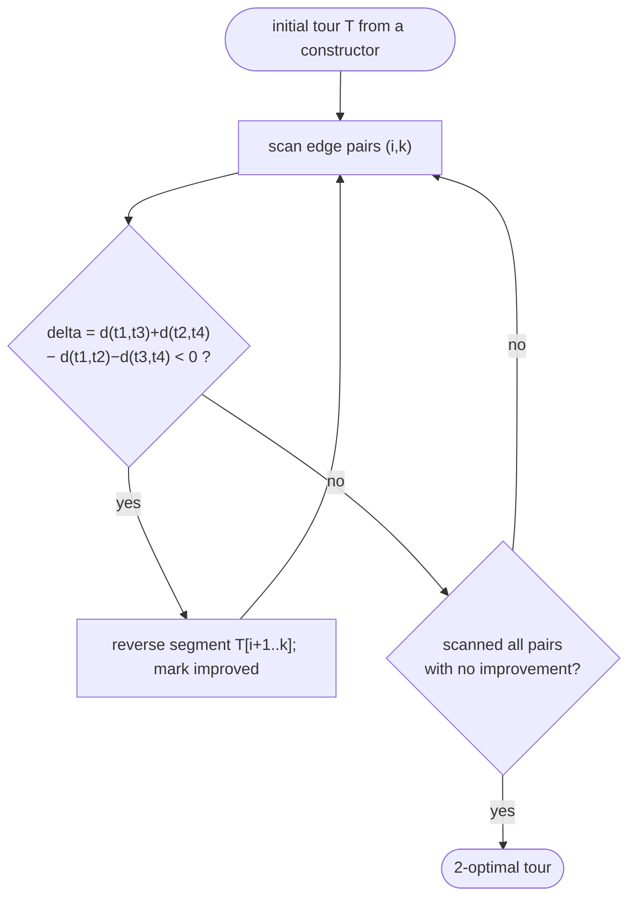

# 2-opt local search — Level 4: Undergraduate CS

> **Example problems:** Traveling Salesman Problem, Vehicle Routing Problem, Job scheduling  ·  **Type:** Heuristic (improvement)  ·  **Guarantee:** No formal bound; big practical improvement
> **Used for:** Improving a tour by uncrossing pairs of edges until no swap helps
> **Level 4 of 6** — undergrad: precise statement, pseudocode, Big-O, local-optimum analysis, mermaid flow. See sibling files for other levels.

---

## Problem statement

Given a tour `T` (a cyclic permutation of `V`, `|V| = n`) on a symmetric distance matrix `d`, **2-opt local search** repeatedly replaces `T` by a shorter tour in its *2-exchange neighborhood* until none exists. It is an **improvement heuristic**: it takes a complete tour (from a constructor such as nearest neighbor, greedy-edge, or nearest insertion) and descends to a **2-opt local optimum**.

## The 2-exchange move

Write the tour as a sequence `… t1 t2 … t3 t4 …` where `(t1,t2)` and `(t3,t4)` are two edges with `t2…t3` the segment between them. The move:

```
remove edges (t1,t2) and (t3,t4)
add    edges (t1,t3) and (t2,t4)
reverse the segment t2 … t3
```

This is the **unique** way (other than the identity) to reconnect the two resulting paths into a single Hamiltonian cycle. The change in tour length — the **gain** — depends only on four distances:

```
gain = [ d(t1,t2) + d(t3,t4) ] − [ d(t1,t3) + d(t2,t4) ]
```

A move is **improving** iff `gain > 0`. A tour with no improving 2-exchange is **2-optimal**.

## Pseudocode

```
TWO_OPT(T, d):
    improved ← true
    while improved:
        improved ← false
        for each pair of tour positions (i, k), 1 ≤ i < k ≤ n:     # the two edges
            (t1,t2) ← (T[i],   T[i+1])
            (t3,t4) ← (T[k],   T[k+1])                              # indices mod n
            delta ← d(t1,t3) + d(t2,t4) − d(t1,t2) − d(t3,t4)       # new − old
            if delta < −ε:                                         # improving
                reverse T[i+1 .. k]                                 # apply the move
                improved ← true
    return T                                                        # 2-optimal
```

Two standard refinements make this fast in practice:
- **Neighbor lists:** only consider `t3` among the *k* nearest cities to `t1` (an improving move almost always adds a short edge `(t1,t3)`), shrinking each scan from `O(n)` to `O(k)`.
- **Don't-look bits:** skip cities whose neighborhood yielded no improvement last time; reset a bit when an incident edge changes.

## Complexity

- **Neighborhood size:** `Θ(n²)` candidate moves (pairs of edges).
- **Gain evaluation:** `O(1)` per move (four lookups).
- **Applying a move:** the segment reversal is `O(n)` with a plain array (the dominant cost), or `O(√n)` with a two-level doubly-linked list — see Level 5/6.
- **One full scan:** `O(n²)`. The number of improving steps to reach a local optimum is `O(n²)`-ish in practice but **exponential in the worst case** (Level 5).
- **Space:** `Θ(n²)` for the matrix (or `Θ(n)` with on-the-fly geometric distances), `Θ(n)` for the tour.

With neighbor lists + don't-look bits, 2-opt runs in **near-linear time per pass** empirically on geometric instances.

## Guarantee (and lack of one)

2-opt has **no constant approximation guarantee** in general. Known facts (Level 6 has citations):
- For metric TSP, 2-opt local optima can be `Θ(log n / log log n)` times optimal in the worst case.
- For random Euclidean instances, 2-opt typically lands **~5% above optimal** — excellent for the cost.
- A 2-optimal Euclidean tour has **no self-crossings** (a crossing is always removable by a 2-exchange), which is the geometric content of "2-optimal."

So 2-opt trades the *provable* constant ratios of the constructive 2-approximations (MST doubling, nearest insertion) for far better *typical* tours with no guarantee.

## Control flow



## Where it sits

2-opt is the **first rung of the k-opt ladder**: it deletes *2* edges and uses the one alternative reconnection. **3-opt** deletes 3 (more reconnections, stronger optima, slower); **Lin–Kernighan** lets the number of deleted edges vary per move. All three consume a constructed tour as their seed and differ only in how richly they re-stitch it.

## One-line summary

`Θ(n²)`-neighborhood improvement heuristic that repeatedly reverses a tour segment whenever doing so shortens the tour, descending to a crossing-free **2-optimal** local optimum — no guarantee, but ~5% above optimal in practice and the base case for 3-opt and Lin–Kernighan.

