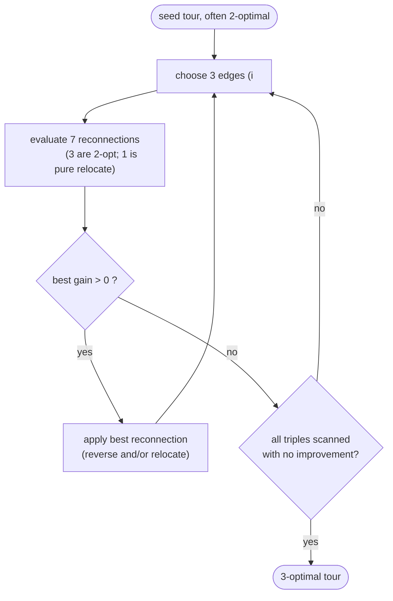

# 3-opt local search — Level 4: Undergraduate CS

> **Example problems:** Traveling Salesman Problem, Vehicle Routing Problem, Job scheduling  ·  **Type:** Heuristic (improvement)  ·  **Guarantee:** No formal bound; better than 2-opt, slower
> **Used for:** Improving a tour via 3-edge reconnections for higher quality than 2-opt
> **Level 4 of 6** — undergrad: precise statement, the 7 reconnections, pseudocode, Big-O, mermaid flow. See sibling files for other levels.

---

## Problem statement

3-opt is iterative improvement over the **3-exchange neighborhood**: from a tour `T`, delete **three** edges, splitting `T` into three paths, and reconnect them into a Hamiltonian cycle in any of the valid ways, keeping an improving result. Its local optima are **3-optimal** tours. As an improvement heuristic it consumes a constructed (often already 2-optimal) tour as a seed.

## The three cut points and the reconnections

Pick three edges by their tour positions `i < j < k`, deleting `(T[i],T[i+1])`, `(T[j],T[j+1])`, `(T[k],T[k+1])`. Label the three resulting paths `A = T[i+1..j]`, `B = T[j+1..k]`, `C = T[k+1..i]` (cyclically). Reconnecting `A, B, C` into one cycle, each optionally reversed, yields **8** arrangements; one is the identity, leaving **7 non-trivial** moves. They classify as:

| Type | Reconnection | Equivalent to |
|------|--------------|---------------|
| 3 moves | reverse exactly one of `A`, `B`, `C` | a single **2-opt** move |
| 3 moves | reverse two of the segments | two stacked 2-opt moves |
| **1 move** | `A · C · B` with **no reversal** (relocate a segment) | a **pure 3-opt** / **Or-opt** move — *not* expressible as one 2-opt |

The "pure" move — splicing a whole segment into a new position **without reversing it** — is the source of 3-opt's extra power: it can *relocate*, where 2-opt can only *reverse*.

## Gain

Each reconnection changes at most 3 edges out and 3 in, so the gain is a constant-size computation:

```
gain = (sum of removed edge lengths) − (sum of added edge lengths)
```

evaluated independently for each of the 7 types; take the maximum positive gain.

## Pseudocode

```
THREE_OPT(T, d):
    improved ← true
    while improved:
        improved ← false
        for i in 0..n-1:
          for j in i+1..n-1:
            for k in j+1..n-1:                         # choose 3 edges
                best ← 0; bestMove ← none
                for each of the 7 reconnection types t:
                    g ← removed(i,j,k) − added(i,j,k,t)
                    if g > best: best ← g; bestMove ← t
                if best > ε:
                    apply bestMove to T                # reverse/relocate segments
                    improved ← true
    return T                                            # 3-optimal
```

Refinements mirror 2-opt: **neighbor lists** (restrict the new edges to near-neighbors), **don't-look bits**, and — because the pure move is a relocation — an `Or-opt` restriction that only relocates short chains (length 1–3) to get most of the benefit at far lower cost.

## Complexity

- **Neighborhood size:** `Θ(n³)` triples of edges (× 7 reconnections, a constant).
- **Gain per candidate:** `O(1)`.
- **One full scan:** `Θ(n³)` — a full order of magnitude over 2-opt's `Θ(n²)`.
- **Applying a move:** up to two segment reversals / one relocation, `O(n)` array-wise (or `O(√n)` with a two-level list).
- With neighbor lists the *effective* cost drops sharply, but 3-opt remains materially slower than 2-opt — the classic quality/time trade.

## Why 3-optimal ⊇ 2-optimal

Every 2-exchange appears among the 7 reconnections (the "reverse one segment" types). Hence a 3-optimal tour has **no** improving 2-opt move either: the set of 3-optimal tours is a **subset** of 2-optimal tours. More moves ⇒ stronger (fewer) local optima ⇒ better worst-case-among-local-optima quality, at higher cost. This is the **k-opt ladder** monotonicity.

## Control flow



## What 3-opt still can't do

3-opt's moves are built from at most three edge deletions reconnected *sequentially*. The **double-bridge** move — delete four edges and reconnect as a non-sequential "`A C B D`" swap — is **not** a 3-opt move. It is the minimal perturbation outside the k-opt-sequential world and the engine of **chained Lin–Kernighan** (last entry of this cluster). Remembering this gap is the whole motivation for what comes after Lin–Kernighan.

## One-line summary

`Θ(n³)`-neighborhood improvement heuristic that deletes three edges and keeps the best of 7 reconnections — including the **relocate-a-segment** move 2-opt lacks — yielding strictly stronger (3-optimal ⊆ 2-optimal) tours at an order-of-magnitude higher cost, and motivating the *variable*-depth jump to Lin–Kernighan.

