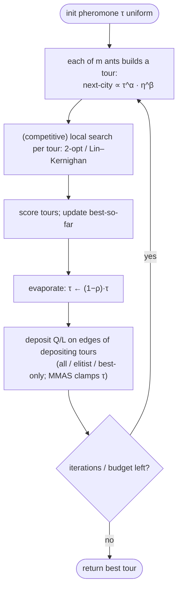

# Ant colony optimization — Level 4: Undergraduate CS

> **Example problems:** Traveling Salesman Problem, Vehicle Routing Problem, Network routing  ·  **Type:** Metaheuristic  ·  **Guarantee:** No guarantee; often good on structured instances
> **Used for:** Pheromone-guided construction inspired by ant foraging
> **Level 4 of 6** — undergrad: precise statement, the transition rule, pheromone update, variants, complexity, mermaid. See sibling files for other levels.

---

## Problem statement

Ant colony optimization (ACO) is a **population-based, constructive** metaheuristic. A colony of `m` artificial **ants** each builds a solution incrementally, guided by **pheromone** `τ` (adaptive, shared memory) and a **heuristic** `η` (static problem knowledge). After each iteration, pheromone is **evaporated** and **reinforced** based on solution quality, so the construction bias improves over rounds. For TSP, an ant builds a tour city-by-city; `τ_{ij}` lives on edge `(i,j)` and `η_{ij} = 1/d_{ij}`.

## The random-proportional transition rule

An ant at city `i`, with `N_i` the set of unvisited cities, moves to `j ∈ N_i` with probability

```
            (τ_ij)^α · (η_ij)^β
p_ij  =  ───────────────────────────      ,   η_ij = 1 / d_ij
          Σ_{l ∈ N_i} (τ_il)^α · (η_il)^β
```

- `α` weights **learned** pheromone; `β` weights **greedy** distance. `α=0` ⇒ pure greedy nearest-neighbor-ish; `β=0` ⇒ pheromone-only (ignores distance). Typical: `α=1, β∈[2,5]`.
- **Ant Colony System (ACS)** adds a *pseudo-random-proportional* rule: with probability `q0` take the **arg max** of `τ^α·η^β` (exploit), else sample as above (explore).

## Pheromone update

After all ants build tours, update every edge:

```
τ_ij  ←  (1 − ρ) · τ_ij   +   Σ_{ants k using (i,j)}  Δτ^k_ij
```

- **Evaporation** `(1−ρ)` with rate `ρ ∈ (0,1]` discards stale trails (prevents unbounded growth and lock-in).
- **Deposit** `Δτ^k_ij = Q / L_k` for ants traversing `(i,j)` (`L_k` = tour length): **shorter tours deposit more.**
- **Who deposits** distinguishes the variants:
  - **Ant System (AS)** — all ants deposit.
  - **Elitist AS / rank-based AS** — best ants weighted more.
  - **MAX–MIN Ant System (MMAS)** — only the **iteration-best or best-so-far** ant deposits; pheromone clamped to `[τ_min, τ_max]` to preserve exploration. *(Strongest plain-ACO variant for TSP.)*
  - **Ant Colony System (ACS)** — best-so-far global update + a **local** update that *lowers* `τ` on edges as they're used (encouraging other ants to diversify).

## Pseudocode

```
ACO_TSP(d, m, alpha, beta, rho, Q, iterations):
    τ_ij ← τ0 for all edges                      # uniform init (MMAS: τ_max)
    best ← null
    repeat iterations times:
        tours ← []
        for k in 1..m:                            # each ant builds a tour
            start ant at a (random) city
            while unvisited cities remain:
                pick next city j by p_ij ∝ (τ_ij)^α (η_ij)^β
            # --- competitive variants: localSearch(tour) via 2-opt / Lin–Kernighan ---
            tours.add(tour); update best
        # evaporation
        for all (i,j): τ_ij ← (1−rho)·τ_ij
        # deposit (variant-dependent: all ants / elitist / best-only)
        for each depositing tour T with length L:
            for (i,j) in T: τ_ij ← τ_ij + Q / L
        (MMAS) clamp τ_ij to [τ_min, τ_max]
    return best
```

## Two forces, one product

ACO's signature is the multiplicative blend `τ^α · η^β`: **static heuristic** (`η`, instant common sense) × **learned memory** (`τ`, accumulated colony experience). This is what separates ACO from the other metaheuristics — it explicitly *learns a probability model over solution components* (edges), making it a precursor of **model-based / estimation-of-distribution** search.

## Complexity (per iteration)

- **Construction:** each ant makes `n` choices, each scanning `O(n)` candidates ⇒ `O(n²)` per ant, `O(m·n²)` per iteration. **Candidate lists** (restrict choices to the `~20` nearest cities) cut this dramatically — essential for large `n`.
- **Pheromone update:** `O(n²)` evaporation (or `O(n·|deposit|)` if sparse) per iteration.
- **Local search (competitive variants):** dominant — a 2-opt/LK descent per ant.
- **Total:** `O(iterations · (m·n² + localSearch))`. Space `O(n²)` for `τ` and `d`. Construction across ants is **embarrassingly parallel**.

## Control flow



## Where it sits

ACO is the second **population-based** metaheuristic here, but unlike the genetic algorithm (which **recombines** complete tours) ACO **constructs** tours from a learned **pheromone model** — population *plus* construction *plus* model-learning. Like the GA, its competitive TSP form is **hybrid** (ACO + local search), the recurring bridge to the local-search cluster. Its escape mechanism is **stochastic re-construction under an evolving bias**, contrasting SA's thermal acceptance and the GA's recombination.

## One-line summary

A constructive, population-based metaheuristic where ants build tours by sampling `τ^α·η^β` (learned pheromone × `1/distance`), then **evaporate + reinforce** pheromone toward shorter tours — best in its **MMAS/ACS + local-search** form, generic for routing, with no guarantee but a distinctive *learn-a-model-over-edges* mechanism.

