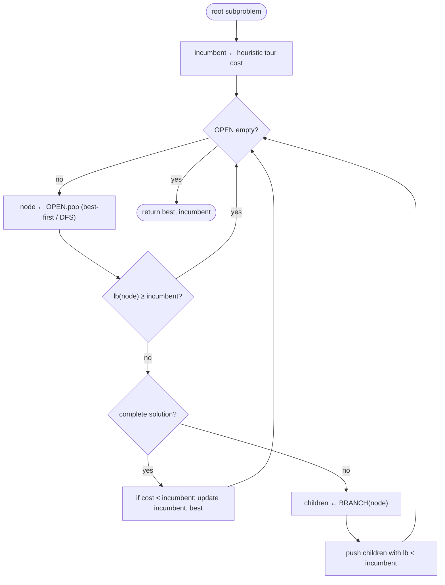

# Branch-and-bound — Level 4: Undergraduate CS

> **Example problems:** Traveling Salesman Problem, 0/1 Knapsack, Integer programming, Job scheduling  ·  **Type:** Exact  ·  **Guarantee:** Optimal tour with pruning based on bounds
> **Used for:** General exact search that prunes provably bad subtrees
> **Level 4 of 6** — undergrad: precise statement, pseudocode, Big-O, correctness, control-flow diagram. See sibling files for other levels.

---

## Problem statement & framing

Minimize `cost(x)` over a combinatorial feasible set `𝓢` (for TSP: Hamiltonian cycles on `K_n`). Branch-and-bound (Land & Doig 1960; Little et al. 1963 for TSP) is a **general exact search paradigm**: implicitly enumerate `𝓢` as a tree of partial solutions, and use a **lower bound** on each subtree's best achievable cost to discard subtrees that cannot beat the best complete solution found so far (the **incumbent**).

Three problem-specific components define an instantiation:
- **Branching rule:** how to split a subproblem into smaller disjoint subproblems (e.g. "next city ∈ {unvisited}", or "edge e is in / out of the tour"). The children must partition the parent's feasible set.
- **Bounding function `lb(node)`:** a value satisfying `lb(node) ≤ min{ cost(x) : x feasible in node's subtree }` — i.e. an **optimistic** (never-overestimating) estimate. For TSP, common bounds: row/column reduction of the cost matrix (Little et al.), or the **Held–Karp 1-tree / Lagrangian bound** (tight, used in serious solvers).
- **Search/selection order:** which open node to expand next.

## Pruning rules

A node is pruned (fathomed) when any holds:
1. **Bound prune:** `lb(node) ≥ incumbent` — cannot improve.
2. **Infeasible:** the subtree contains no feasible completion.
3. **Optimal-leaf:** the node is a complete solution; update the incumbent and stop expanding it.

## Pseudocode

```
BRANCH_AND_BOUND(root):
    incumbent ← +∞ ; best ← null
    # optional: seed incumbent with a heuristic solution (e.g. nearest-neighbor tour)
    incumbent ← cost(heuristic_solution()) ; best ← that solution
    OPEN ← priority_or_stack containing root
    while OPEN not empty:
        node ← OPEN.pop()                       # order = search strategy (below)
        if lb(node) ≥ incumbent:                # (1) bound prune — stale nodes too
            continue
        if node is a complete solution:
            if cost(node) < incumbent:
                incumbent ← cost(node) ; best ← node
            continue
        for child in BRANCH(node):              # disjoint subproblems
            if lb(child) < incumbent:           # cheap pre-check before pushing
                OPEN.push(child)
    return best, incumbent
```

**Search strategies** (the `OPEN` discipline):
- **Best-first** (priority queue keyed by `lb`): expands the most promising node; minimizes nodes explored for a given bound, but `OPEN` can grow to `O(size of frontier)` memory.
- **Depth-first** (stack): low `O(depth)` memory, finds complete solutions quickly to tighten the incumbent early; may explore more nodes. Most practical TSP B&B is DFS or hybrid.
- **A\*** is best-first B&B with `lb = g + h` and an admissible `h` — the same optimism condition.

## TSP instantiation (sketch)

- **Branch:** fix the next vertex (path-form) or decide an edge in/out (Little et al. matrix form).
- **Bound:** reduce the cost matrix (subtract row minima, then column minima; the sum of reductions is a valid lower bound), or compute the Held–Karp 1-tree bound via Lagrangian ascent.
- **Incumbent seed:** a nearest-neighbor or greedy tour.

## Complexity

- **Worst case:** `O(|𝓢|)` up to polynomial bookkeeping — for TSP that is `Θ(n!)`-class. Branch-and-bound gives **no better worst-case bound than brute force**; a pathological instance (or a weak bound) can force near-complete enumeration.
- **Typical case:** with a good bound, pruning is dramatic — orders of magnitude fewer nodes — letting it solve instances far beyond brute force's reach (and, in the branch-and-**cut** extension, beyond Held–Karp's `2ⁿ`).
- **Memory:** best-first `O(frontier)` (can be exponential); depth-first `O(n)`. The time/memory trade-off is the main strategy choice.
- The value of B&B is **empirical pruning**, not an improved asymptotic guarantee — an important distinction from Held–Karp, which *does* guarantee `O(n²2ⁿ)`.

## Correctness

- **Soundness of pruning:** since `lb(node) ≤` every cost in its subtree, `lb(node) ≥ incumbent` implies no descendant beats the incumbent — pruning discards nothing optimal. This requires the bound to be a *valid lower bound* (admissible); tightness affects only speed, never correctness.
- **Completeness:** branching partitions the feasible set, so every feasible solution lies in exactly one leaf; unpruned leaves are all evaluated. The incumbent therefore converges to the true optimum.
- **Termination:** the tree is finite (finite `𝓢`); each node is expanded once.

## Control flow



## Guarantee, in one line

Exact optimum via implicit enumeration; correctness needs only an *optimistic* bound, speed needs a *tight* one; worst-case `Θ(n!)`-class but typically prunes massively — the exact-search workhorse and the backbone of branch-and-cut.
