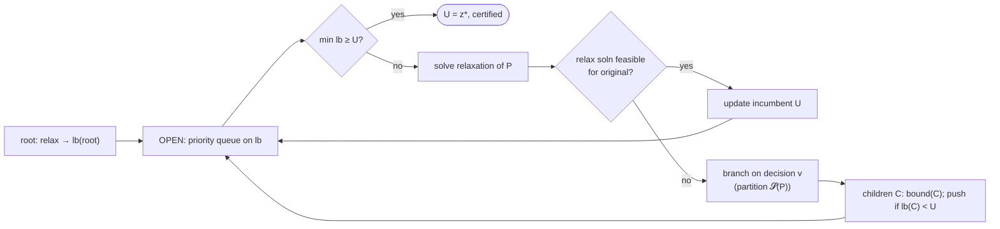

# Branch-and-bound — Level 5: Graduate

> **Example problems:** Traveling Salesman Problem, 0/1 Knapsack, Integer programming, Job scheduling  ·  **Type:** Exact  ·  **Guarantee:** Optimal tour with pruning based on bounds
> **Used for:** General exact search that prunes provably bad subtrees
> **Level 5 of 6** — graduate: formal model, paradigm, bounds, proofs, search strategies, edge cases, optimizations. See sibling files for other levels.

---

## 1. Formal model

Minimize `c(x)` over feasible set `𝓢`. Branch-and-bound maintains a partition of `𝓢` into **subproblems** `P_1, …, P_k` (a *branching tree*) and, for each, a **lower bound** `lb(P) ≤ z*(P) := min_{x ∈ 𝓢(P)} c(x)`. Let `U` be the incumbent value (cost of the best feasible solution found). The core invariants:

```
(B1)  lb(P) ≤ z*(P)                          [validity / optimism of the bound]
(B2)  𝓢(P) = ⊎_{child C of P} 𝓢(C)           [branching partitions feasibility]
(B3)  U ≥ z*  at all times, and U = c(x) for some feasible x   [incumbent is a real solution]
```

**Fathoming (prune) rules.** A node `P` is closed when:
- `lb(P) ≥ U` (bound dominance), or
- `𝓢(P) = ∅` (infeasibility), or
- the bounding relaxation's optimum is feasible for the original problem (then `z*(P)` is found exactly; update `U`).

The process is an instance of the **relaxation paradigm**: `lb(P)` is typically the optimum of a *relaxation* of `P` (LP relaxation for ILP, 1-tree relaxation for TSP, fractional knapsack for 0/1 knapsack) — relaxations are easy and give valid lower bounds by enlarging the feasible set.

## 2. Correctness, formally

**Theorem.** If every `lb` satisfies (B1) and branching satisfies (B2), branch-and-bound terminates with `U = z*` (the global optimum).

**Proof.**
*Soundness:* when a node `P` is pruned by `lb(P) ≥ U`, every `x ∈ 𝓢(P)` has `c(x) ≥ z*(P) ≥ lb(P) ≥ U`, so no discarded solution improves on the incumbent. Thus the optimum is never fathomed away.
*Completeness:* by (B2), `𝓢 = ⊎` (leaves not pruned by infeasibility), and every retained leaf is evaluated; the optimum `x*` resides in some leaf and is either evaluated (updating `U` to `z*`) or pruned only when `U ≤ c(x*) = z*` already holds — but `U ≥ z*` always (B3), forcing `U = z*`.
*Termination:* `𝓢` finite ⇒ finite tree (each branch strictly shrinks the subproblem); each node processed once. ∎

Note correctness uses **only validity (B1)**, never tightness. Tightness governs the *number of nodes explored*, hence runtime — the entire engineering payoff.

## 3. How good is the bound? The integrality/duality gap

Let `z_LP(P)` be a relaxation bound. The **gap** `z*(P) − z_LP(P)` controls pruning power:
- **TSP bounds, increasing strength:** matrix row/column reduction (Little–Murty–Sweeney–Karel 1963) < nearest-neighbor/assignment-relaxation (drop subtour constraints, solve assignment problem, `O(n³)` Hungarian) < **Held–Karp 1-tree / Lagrangian bound** (Held & Karp 1970/71), which equals the LP value of the subtour-elimination relaxation and is typically within ~1–2% of `z*` on Euclidean instances.
- The **assignment relaxation** is elegant: relax "tour" to "permutation/2-regular digraph," solve as min-cost assignment; if the solution has subtours, branch to forbid them (this *is* Little et al.'s scheme).
- **Lagrangian relaxation** dualizes complicating constraints (degree constraints), maximizing `lb` over multipliers via subgradient/ascent — the Held–Karp bound is exactly this on the 1-tree.

A tighter bound shrinks the **set of nodes with `lb < U`** that must be opened; in the limit of an exact bound, B&B opens `O(path-to-optimum)` nodes.

## 4. Search strategy: ordering the open set

`OPEN` is a node pool; the **selection rule** trades nodes-explored against memory:

| Strategy | Selection key | Memory | Property |
|----------|---------------|--------|----------|
| **Best-first** | min `lb` | `O(\|frontier\|)` (can be exp.) | Minimizes #nodes opened for fixed bound; "no node with `lb < z*` is *un*opened, none with `lb > z*` opened" |
| **Depth-first** | LIFO | `O(depth)` | Finds incumbents early (tightens `U` fast), cheap memory; may reopen dominated work |
| **Best-bound + DFS dive (hybrid)** | mixed | tunable | Standard in MILP solvers (CPLEX/Gurobi style) |
| **A\*** | `g + h`, `h` admissible | `O(\|frontier\|)` | Best-first B&B; admissibility = bound validity |

**Branching rule** matters as much as the bound: *strong branching* (tentatively evaluate children's bounds to pick the most decisive split), *pseudo-cost branching*, *most-fractional* variable in ILP. Good branching reduces tree size super-linearly in practice.

## 5. Pseudocode (relaxation-bound, best-first)

```
B&B(root):
    U ← cost(primal_heuristic())        # incumbent: nearest-neighbor / greedy tour
    best ← that solution
    OPEN ← priority_queue keyed by lb;  push(root, lb(root))
    while OPEN nonempty:
        (P, lbP) ← extract_min(OPEN)
        if lbP ≥ U: break               # best-first ⇒ all remaining ≥ U  ⇒ DONE (optimality proof)
        (xP, zP) ← solve_relaxation(P)  # zP = lb(P)
        if relaxation infeasible: continue
        if xP feasible for original:    # bound is exact here
            if zP < U: U ← zP; best ← xP
            continue
        v ← select_branching_decision(P, xP)      # e.g. fractional/most-decisive var, subtour to cut
        for C in branch(P, v):          # disjoint, covering
            lbC ← bound(C)
            if lbC < U: push(C, lbC)
    return best, U                      # U = z*, certified optimal
```

The `lbP ≥ U ⇒ break` line is the **optimality certificate**: in best-first order, once the minimum open bound reaches `U`, every unopened node is provably non-improving.



## 6. Edge cases, invariants, optimizations

- **Worst case = brute force.** No improved asymptotic guarantee; adversarial instances or weak bounds force `Θ(|𝓢|)`. B&B's value is empirical pruning, *certified* optimality, and an **anytime** property (the `U`/`lb` pair brackets `z*` so you can stop early with a provable optimality gap `(U − min lb)/U`).
- **Incumbent seeding & bound tightening interplay:** a strong primal heuristic raises... lowers `U` early ⇒ more pruning; a strong dual bound raises `lb` ⇒ more pruning. Both ends squeeze the gap.
- **Numerical care:** floating-point bounds need tolerance (`lb ≥ U − ε`) to avoid both false pruning and cycling.
- **Symmetry:** symmetric solution spaces (e.g. tour reflection) waste effort; symmetry-breaking constraints / orbital branching help.
- **Branch-and-cut (the headline optimization):** between branchings, **add cutting planes** (valid inequalities — subtour-elimination, comb, blossom inequalities for TSP) to tighten the LP relaxation *in place*, raising `lb` without branching. This is how **Concorde** solves TSPs with tens of thousands of cities to proven optimality — covered as the next exact sibling.
- **Branch-and-price:** column generation inside B&B for problems with exponentially many variables (VRP, cutting stock).
- **Parallelism:** the tree is naturally parallel, but load balancing + incumbent sharing across workers is nontrivial (anomalies: more processors occasionally explore more nodes).

**Synthesis:** branch-and-bound is the **relaxation-and-partition** paradigm for exact combinatorial optimization: branch to partition the feasible set, bound each part with an optimistic relaxation, prune any part that cannot beat the incumbent. Correctness rests solely on the bound being a *valid lower bound*; all performance rests on the bound's *tightness*, the *branching rule*, and the *search order*. With weak bounds it degrades to enumeration; with strong relaxations and cutting planes it becomes branch-and-cut, the state of the art in exact TSP and integer programming.
