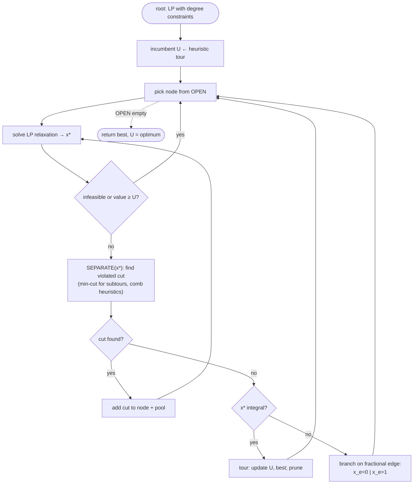

# Branch-and-cut (ILP / Concorde-style) — Level 4: Undergraduate CS

> **Example problems:** Traveling Salesman Problem, Mixed-integer linear programs, Vehicle Routing Problem, Max-cut  ·  **Type:** Exact  ·  **Guarantee:** Optimal tour; state-of-the-art exact performance
> **Used for:** Research-grade exact solving by combining branching with cutting planes
> **Level 4 of 6** — undergrad: ILP formulation, pseudocode, complexity, correctness, control-flow diagram. See sibling files for other levels.

---

## Problem statement: TSP as an integer linear program

Symmetric TSP on `K_n`, edge variables `x_e ∈ {0,1}` (edge used or not), edge costs `d_e`. The **Dantzig–Fulkerson–Johnson (DFJ, 1954)** formulation:

```
minimize    Σ_e d_e x_e
subject to  Σ_{e ∋ v} x_e = 2                     ∀ v ∈ V        (degree: 2 edges per city)
            Σ_{e ∈ δ(S)} x_e ≥ 2                   ∀ S ⊂ V, 2≤|S|≤n-1   (subtour elimination)
            x_e ∈ {0,1}                            ∀ e
```

`δ(S)` = edges with exactly one endpoint in `S` (the cut induced by `S`). The subtour-elimination constraints (SECs) forbid disconnected sub-loops, but there are **exponentially many** (`2ⁿ` subsets) — you cannot list them all. That is the central problem branch-and-cut solves: **generate the needed inequalities on demand.**

## The two relaxations

- **LP relaxation:** drop integrality (`x_e ∈ [0,1]`). An LP is poly-time solvable (simplex/interior-point) and gives a **lower bound**.
- **Cutting-plane relaxation:** start with only degree constraints (+ a few SECs), solve the LP, then *separate*: find a violated inequality, add it, re-solve. Repeat until no violation found.

The **separation problem** — "given a fractional `x*`, find a violated valid inequality or prove none exists" — is the engine. For SECs it is solvable in polynomial time via **min-cut / max-flow**: a subtour constraint is violated iff the global min-cut of the support graph (capacities `x*_e`) is `< 2`; the min-cut set `S` gives the violated `δ(S)`.

## The algorithm

Branch-and-cut = **branch-and-bound where each node's bound is computed by cutting-plane refinement of the LP relaxation**, with cuts optionally shared across the tree.

```
BRANCH_AND_CUT(instance):
    U ← cost(heuristic_tour())               # incumbent (e.g. Lin–Kernighan tour)
    model ← LP with degree constraints only
    OPEN ← { root = model }
    while OPEN nonempty:
        node ← select(OPEN)                   # best-bound / DFS
        repeat                                # ---- cutting-plane loop at this node ----
            x* ← solve_LP(node)
            if LP infeasible or value(x*) ≥ U: prune node; goto next
            cuts ← SEPARATE(x*)               # violated SECs (min-cut), combs, etc.
            if cuts ≠ ∅: add cuts to node (and pool); continue loop
        until no cuts found
        if x* is integral:                    # a real tour
            if value(x*) < U: U ← value(x*); best ← x*
            prune node
        else:                                 # fractional but no cut found ⇒ branch
            e ← select_branching_edge(x*)     # most-fractional x*_e, etc.
            OPEN ← OPEN ∪ { node ∧ x_e=0,  node ∧ x_e=1 }
    return best, U                            # certified optimal
```

`SEPARATE` is the heart: exact poly-time for SECs (min-cut), heuristic for harder families (comb, blossom, clique-tree inequalities).

## Complexity

- **Per LP solve:** polynomial in the current model size.
- **Separation (SEC):** `O(n³)`–`O(n·m)` style max-flow per round (e.g. Gomory–Hu tree gives all min-cuts).
- **Overall worst case:** still **exponential** — `Θ(2ⁿ)`-class — because the branch tree can be exponential and there are exponentially many potential cuts. Branch-and-cut, like branch-and-bound, offers **no improved worst-case guarantee** over enumeration.
- **In practice:** the LP+cut bound is so tight (often <1–2% gap on Euclidean instances) that the tree stays small; this is what makes it the *fastest exact method known* for TSP and MILP. The win is empirical, certified by the final `bound = incumbent`.

## Correctness

- **Validity of cuts:** every inequality added (degree, SEC, comb, …) is satisfied by **all** integer tours, so the integer feasible set is never altered — only fractional/illegal LP points are removed. Hence the optimum is preserved.
- **Bound soundness:** the LP optimum is ≤ every integer solution in the node's subtree (relaxation), so pruning when `LP ≥ U` is safe — identical argument to branch-and-bound.
- **Termination:** finitely many `x_e ∈ {0,1}` assignments bound the branch tree; each node's cut loop terminates (only finitely many distinct facet-defining cuts; in practice capped per round).
- **Certificate:** halting with `min open LP bound = U` proves `U` is the global optimum.

## Control flow



## Guarantee, in one line

Exact optimum via LP relaxation + on-demand cutting planes (separated by min-cut) inside a branch-and-bound tree; worst-case exponential but, with strong TSP cuts, the **state-of-the-art exact solver** (Concorde) — proven-optimal tours at tens of thousands of cities.
