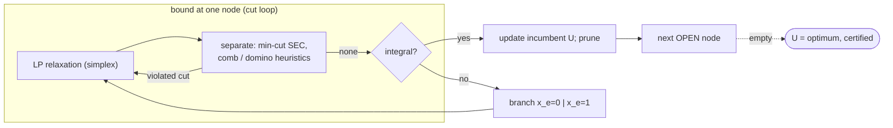

# Branch-and-cut (ILP / Concorde-style) — Level 5: Graduate

> **Example problems:** Traveling Salesman Problem, Mixed-integer linear programs, Vehicle Routing Problem, Max-cut  ·  **Type:** Exact  ·  **Guarantee:** Optimal tour; state-of-the-art exact performance
> **Used for:** Research-grade exact solving by combining branching with cutting planes
> **Level 5 of 6** — graduate: polyhedral theory, separation, formal correctness, the cut families, edge cases, optimizations. See sibling files for other levels.

---

## 1. Polyhedral foundation

Let the **TSP polytope** be `P_TSP = conv{ x ∈ {0,1}^E : x is the incidence vector of a Hamiltonian tour }`. Optimizing a linear objective over `P_TSP` *is* TSP; if we had its full facet description, one LP would solve TSP. We don't — `P_TSP` has facets that are NP-hard to recognize in general, and exponentially (super-exponentially) many. Branch-and-cut **approximates `P_TSP` from outside**, locally, with valid inequalities generated where the current LP optimum lies.

A linear relaxation `P_LP ⊇ P_TSP`. The **DFJ relaxation**:
```
x(δ(v)) = 2 ∀v        (degree)
x(δ(S)) ≥ 2 ∀ ∅≠S⊊V   (subtour elimination, SEC)   — equivalently  x(E(S)) ≤ |S|−1
0 ≤ x_e ≤ 1
```
gives the **subtour polytope** `P_SEP`. Its value equals the **Held–Karp lower bound** (the 1-tree/Lagrangian bound from the Held–Karp DP sibling is *the same number* — LP duality of the subtour relaxation), typically within ~1–2% of optimal on Euclidean instances. Branch-and-cut then strengthens `P_SEP` with deeper facet families.

## 2. Valid inequalities, cuts, and facets

- **Valid inequality** `aᵀx ≤ b`: holds for all `x ∈ P_TSP`. Adding it preserves the integer optimum (Section 4).
- **Cut (cutting plane):** a valid inequality *violated by the current fractional* `x*` — separating `x*` from `P_TSP`.
- **Facet:** a valid inequality defining a maximal-dimension face of `P_TSP`; facet-defining cuts are the strongest (non-dominated). TSP cut families, increasing strength:
  - **Subtour elimination (SEC)** — connectivity; separable **exactly in poly time**.
  - **Comb inequalities** (Chvátal, Grötschel–Padberg): a handle + odd number of teeth; facet-defining. Separation NP-hard in general; effective heuristics exist. **2-matching/blossom** inequalities are the simplest combs.
  - **Clique-tree, path, star, bipartition, domino-parity** inequalities — progressively richer; **domino-parity** cuts (Letchford) admit polynomial *planar* separation and were key to Concorde's largest solves.

**Gomory mixed-integer (GMI)** cuts and **MIR** cuts are *general-purpose* (problem-agnostic) cuts derived from the simplex tableau — the backbone of general MILP branch-and-cut, complementary to the combinatorial TSP-specific families.

## 3. The separation problem (the computational core)

> **SEP:** given `x* ∈ P_LP`, return a valid inequality violated by `x*`, or certify `x* ∈` (the family's) polytope.

The **Grötschel–Lovász–Schrijver** equivalence of **separation and optimization** (via the ellipsoid method) is the theoretical bedrock: a family can be optimized over in poly time iff it can be separated in poly time. Consequences here:
- **SEC separation = global min-cut.** `x(δ(S)) ≥ 2` is violated for some `S` iff the min-cut of the support graph (capacities `x*_e`) is `< 2`. Compute via max-flow / a **Gomory–Hu tree** (`n−1` max-flows give all pairwise min-cuts) → exact poly-time separation.
- **Comb separation** is NP-hard in general; Concorde uses **heuristic separation** (block decomposition, shrinking/safe shrinking of `x*=1` edges, odd-component combs) plus exact domino-parity for planar support.

Cutting planes are kept in a **cut pool** and shared across tree nodes; cuts are added globally (valid everywhere) or locally (valid in a node's subtree).

## 4. Correctness, formally

**Proposition (cut validity preserves optimum).** If `aᵀx ≤ b` holds for all `x ∈ P_TSP`, then `min{ d·x : x ∈ P_LP ∩ {aᵀx ≤ b}, integral } = min{ d·x : x ∈ P_TSP }`. *Proof:* the integer feasible set `P_LP ∩ ℤ^E` restricted to tours is unchanged because every tour already satisfies `aᵀx ≤ b`; only fractional points are removed. ∎

**Theorem (branch-and-cut is exact).** With (i) every separated inequality valid for `P_TSP`, (ii) branching partitioning the feasible `0/1` set (`x_e=0 ⊎ x_e=1`), and (iii) LP relaxation giving a valid lower bound per node, branch-and-cut terminates with the global optimum and a certificate `U = max_{open} LP-bound`.
*Proof sketch:* validity ⇒ no tour removed (Prop.); LP bound ≤ node optimum ⇒ pruning sound (relaxation); branching is finite and exhaustive over `{0,1}^E` ⇒ completeness + termination; the meeting of incumbent and best open bound certifies optimality. Inherits the branch-and-bound correctness theorem with cuts as bound-tightening. ∎

Correctness needs only **validity**; *facet-ness/tightness* governs only the tree size.

## 5. Annotated algorithm

```
BRANCH_AND_CUT(d, n):
    U ← LinKernighan_tour_cost()                 # strong primal heuristic ⇒ tight incumbent
    root ← LP{ degree constraints, 0≤x≤1 }
    pool ← ∅ ;  OPEN ← {root}
    while OPEN ≠ ∅:
        node ← select(OPEN)                       # best-first on LP bound, with DFS dives
        loop:                                     # ---- cut-generation at node ----
            x* ← simplex(node ∪ applicable(pool))
            if infeasible or obj(x*) ≥ U − ε: prune; break-to-while
            V ← SEP_SEC(x*)                        # exact: min-cut < 2  (Gomory–Hu)
            V ← V ∪ SEP_COMB(x*) ∪ SEP_DOMINO(x*)  # heuristic / planar-exact
            if V ≠ ∅: add V to node and pool; continue loop
            break                                  # no violated cut ⇒ LP at this node is final
        if x* integral:
            U ← min(U, obj(x*)); update best; prune
        else:
            e ← branch_var(x*)                     # strong/pseudocost branching on a fractional edge
            push(node ∧ x_e=0); push(node ∧ x_e=1)
    return best, U
```



## 6. Edge cases, invariants, optimizations

- **Branch-and-cut vs cut-and-branch:** pure *cutting-plane* (Gomory 1958) at the root alone can converge but suffers numerical instability and slow tail; *pure branch-and-bound* has weak bounds. Branch-and-cut interleaves them — cuts at (many) nodes — which is the robust sweet spot. **Cut-and-branch** = cut only at the root, then branch (cheaper, weaker).
- **Branch-and-cut-and-price:** add **column generation** (price new variables) alongside cuts — essential for VRP/crew-scheduling set-partitioning models with exponentially many columns *and* rows.
- **Numerical robustness:** LP tolerances, cut purging (drop slack cuts to keep the LP small), avoiding near-parallel cuts, exact/rational LP for certified optimality (Concorde can verify with exact arithmetic).
- **Primal heuristics matter:** a tight `U` from Lin–Kernighan / chained-LK prunes aggressively; B&C pairs a strong dual bound (cuts) with a strong primal bound (heuristic) — both ends squeeze the gap.
- **Invariant:** at all times `max_{open} LP-bound ≤ z* ≤ U`; the pair is an **anytime** optimality gap, so the solver can stop early with a *provable* `(U − L)/U` guarantee.
- **Worst case unchanged:** exponential; adversarial instances defeat any fixed cut set. Practical power is instance-structure-dependent (Euclidean ≪ random/adversarial).

**Synthesis:** branch-and-cut is **polyhedral branch-and-bound**: model the problem as an ILP, relax to an LP over an outer approximation of `P_TSP`, and *dynamically tighten* that approximation with separated cutting planes (subtour via min-cut, then combs/domino-parity), branching only when separation stalls. Correctness rests on cut **validity**; performance rests on cut **strength** + **separation efficiency** + **branching** + a strong primal heuristic. The Held–Karp subtour bound is its starting relaxation; the comb/clique-tree/domino families take it the rest of the way — making it, via Concorde, the exact-TSP and MILP state of the art.
