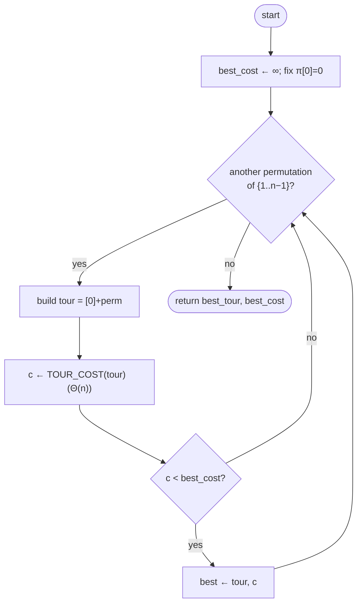

# Brute force enumeration — Level 4: Undergraduate CS

> **Example problems:** Traveling Salesman Problem, Vehicle Routing Problem (tiny), small permutation / sequencing problems  ·  **Type:** Exact  ·  **Guarantee:** Optimal tour for very small n
> **Used for:** Teaching and tiny instances; ground-truth baseline to check other methods
> **Level 4 of 6** — undergrad: precise statement, pseudocode, Big-O, correctness, control-flow diagram. See sibling files for other levels.

---

## Problem statement

Given a complete graph on `n` vertices `V = {0, 1, …, n−1}` with a cost function `d: V × V → ℝ≥0`, find a **Hamiltonian cycle** (a permutation visiting every vertex exactly once and returning to start) of minimum total cost:

```
minimize  cost(π) = d(π[n−1], π[0]) + Σ_{i=0}^{n−2} d(π[i], π[i+1])
over      π ∈ permutations of V
```

Brute force enumeration solves this **exactly** by generating the full search space of candidate tours, scoring each, and returning the minimum. No bounds, no pruning, no heuristics — the defining trait is *completeness*: every feasible solution is materialized and evaluated.

## Pruning the symmetry (without changing the answer)

Two reductions shrink the space while preserving optimality, because they only discard *duplicates*, not distinct tours:

1. **Fix the start vertex.** A cycle is rotation-invariant, so we pin `π[0] = 0` and permute only the other `n−1` vertices ⇒ `(n−1)!` tours instead of `n!`.
2. **Fix orientation (symmetric `d`).** Each cycle equals its reverse, so we may additionally require, say, `π[1] < π[n−1]`, halving the count to `(n−1)!/2`.

Reduction 1 is free and standard; reduction 2 applies only when `d` is symmetric. Neither changes the optimum — they prune *redundant representations of the same cycle*.

## Pseudocode

```
BRUTE_FORCE_TSP(d, n):
    best_cost ← +∞
    best_tour ← null
    fix start = 0
    for each permutation perm of {1, 2, …, n−1}:          # (n−1)! iterations
        tour ← [0] + perm
        c ← TOUR_COST(tour, d)
        if c < best_cost:
            best_cost ← c
            best_tour ← tour
    return (best_tour, best_cost)

TOUR_COST(tour, d):
    total ← 0
    for i in 0 … n−1:
        total ← total + d[tour[i]][tour[(i+1) mod n]]      # Θ(n)
    return total
```

A standard recursive generator (fix prefix, recurse on the unused set) is the usual way to enumerate the permutations without storing them all:

```
PERMUTE(prefix, remaining):
    if remaining is empty:
        evaluate prefix as a tour; update best
        return
    for each v in remaining:
        PERMUTE(prefix + [v], remaining − {v})
```

## Complexity

- **Time:** `Θ((n−1)! · n)` — there are `(n−1)!` tours and each costs `Θ(n)` to total. This is `Θ(n!)` up to the linear factor — super-exponential, the worst growth class you meet in practice.
- **Space:** `Θ(n)` with the recursive generator (one tour / call stack at a time). It is **not** necessary to store all permutations; you stream them and keep only the best-so-far. Naively listing every permutation first would cost `Θ(n! · n)` space — avoid that.

Concrete wall: at ~10⁹ tour-evaluations/second, `(n−1)!` becomes infeasible around `n ≈ 13–15` (12! ≈ 4.8×10⁸; 15! ≈ 1.3×10¹²). Contrast the Held–Karp DP sibling at `O(n²·2ⁿ)`, which pushes the exact frontier to ~`n ≈ 20+`.

## Correctness & termination

- **Termination:** the permutation generator visits each of the finitely many `(n−1)!` orderings exactly once and halts.
- **Correctness (optimality):** the feasible region of TSP is *exactly* the set of Hamiltonian cycles, which is in bijection with the permutations enumerated (modulo the rotation/reflection symmetries we deliberately collapsed). Since every feasible tour is scored and the running minimum is maintained, the returned tour attains the global minimum. There is no approximation gap — brute force is exact by construction.

## Control flow



## Guarantees, in one line

Always optimal; `Θ(n!)`-class time; trivially correct; useful only for tiny `n` or as the **ground-truth oracle** to validate the approximate and heuristic methods that follow.
