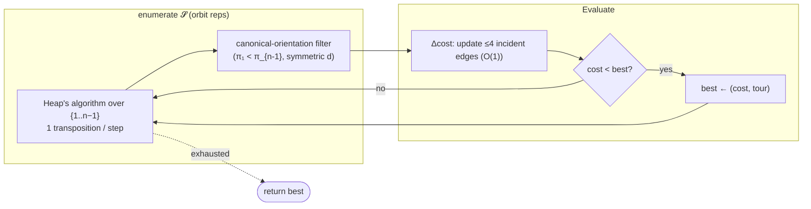

# Brute force enumeration — Level 5: Graduate

> **Example problems:** Traveling Salesman Problem, Vehicle Routing Problem (tiny), small permutation / sequencing problems  ·  **Type:** Exact  ·  **Guarantee:** Optimal tour for very small n
> **Used for:** Teaching and tiny instances; ground-truth baseline to check other methods
> **Level 5 of 6** — graduate: formal model, the paradigm, complexity derivation, symmetry quotient, edge cases, optimizations. See sibling files for other levels.

---

## 1. Formal model

TSP instance: a complete weighted digraph `K_n = (V, d)`, `|V| = n`, `d: V×V → ℝ≥0`. A **tour** is a cyclic permutation `π` of `V`; its cost is `c(π) = Σ_{i} d(π_i, π_{i+1 mod n})`. The feasible set `𝓢` is the set of all Hamiltonian cycles. Brute force enumeration computes

```
π* = argmin_{π ∈ 𝓢} c(π)
```

by **materializing all of `𝓢`** and taking the minimum. It is the canonical instance of **exhaustive / generate-and-test search**: enumerate the entire solution space, evaluate an objective on each candidate, retain the optimum. Its only structural assumption is that `𝓢` is finite and enumerable; it uses *nothing* about the geometry or metric of `d` (no triangle inequality, no bound, no gradient). That generality is exactly why it is both universally correct and universally slow.

## 2. The symmetry quotient (counting `𝓢` correctly)

The naive space is the `n!` sequences over `V`, but tours form equivalence classes under the **dihedral group** `D_n` acting by rotation (cyclic shift, order `n`) and — for symmetric `d` — reflection (order 2). Hence the number of *distinct* tours is

```
|𝓢|  =  n! / |D_n|  =  n! / (2n)  =  (n−1)! / 2        (symmetric TSP)
       =  n! / n     =  (n−1)!                          (asymmetric TSP, rotation only)
```

Enumerating one representative per class — pin `π_0 = 0` (kills rotation), and require `π_1 < π_{n−1}` (kills reflection) — is the standard **orbit-representative** reduction. It is a constant-factor (`2n`×) win, *not* an asymptotic one: brute force stays in the `Θ(n!)` class. The lesson is that symmetry reduction alone never tames factorial growth; you need to exploit *overlapping subproblems* (Held–Karp) or *bounds* (branch-and-bound) for that.

## 3. Complexity, derived

- Distinct candidates: `(n−1)!/2 = Θ((n−1)!)`.
- Objective per candidate: `Θ(n)` to sum the cycle (`Θ(1)` amortized if you enumerate via Steinhaus–Johnson–Trotter / Heap's algorithm and *incrementally* update cost across adjacent transpositions — a swap changes only O(1) edges, though for a *cyclic* cost a single transposition can touch up to 4 incident edges, still O(1)).
- **Total time:** `Θ(n!)` (the `Θ(n)` or `Θ(1)` per-tour factor is swamped). 
- **Space:** `Θ(n)` — stream candidates via a recursive generator or a Heap's-algorithm iterator; never store `𝓢`. Materializing all permutations is a `Θ(n·n!)` space anti-pattern.

Stirling: `n! ~ √(2πn)(n/e)ⁿ`, so `log(n!) = Θ(n log n)`. Brute force is therefore `2^{Θ(n log n)}` — strictly worse than the `2^{Θ(n)}` of the Held–Karp DP, which is the whole point of the DP's `O(n²2ⁿ)` bound.

## 4. Annotated pseudocode (incremental-cost variant)

```
# Heap's algorithm enumerates all permutations of the n−1 free vertices,
# each obtained from the previous by a single transposition ⇒ O(1) cost delta.
BRUTE_FORCE_TSP(d, n):
    free  ← [1, 2, …, n−1]          # vertex 0 pinned as start (rotation quotient)
    tour  ← [0] + free
    best  ← (cost(tour), copy(tour))
    cnt   ← array of zeros, length n−1
    i ← 0
    while i < n−1:
        if cnt[i] < i:
            swap free[ i even ? 0 : cnt[i] ] with free[i]   # Heap's swap rule
            recompute only the ≤4 affected cycle edges       # O(1) incremental Δcost
            if symmetric and not canonical_orientation(tour): # π_1 < π_{n−1} filter
                pass                                          # skip mirror duplicate
            else if cost < best.cost:
                best ← (cost, copy(tour))
            cnt[i] += 1
            i ← 0
        else:
            cnt[i] ← 0
            i ← i + 1
    return best
```

The recursive `PERMUTE(prefix, remaining)` generator is clearer pedagogically; Heap's algorithm is the constant-factor-tuned production form (minimal swaps, in-place, cache-friendly).

## 5. Optimality proof (one line, and why it's trivial)

`𝓢` is finite and enumerated **exhaustively and without omission** (the generator is a bijection onto orbit representatives, and each representative has the same cost as every member of its orbit). The algorithm returns `min_{π∈𝓢} c(π)` because it evaluates `c` on a complete set of representatives and tracks the running argmin. Optimality is immediate from completeness — brute force is the *definition* of the optimum made executable. The interesting content of TSP theory is entirely about avoiding this enumeration, not about its correctness.



## 6. Edge cases, invariants, and what it buys you

- **`n ≤ 2`:** degenerate (one or zero tours); guard explicitly.
- **Asymmetric `d` (ATSP):** drop the reflection filter; `|𝓢| = (n−1)!`. Brute force needs *no* modification beyond that — its indifference to `d`'s structure is a feature here, where metric-dependent methods (Christofides) don't apply.
- **Non-metric / negative-free arbitrary `d`:** still exact — no triangle inequality assumed.
- **Invariant:** `best` always holds the optimum over all representatives enumerated so far; on termination that set is all of `𝓢`.
- **Practical role:** the **ground-truth oracle**. Because it is unconditionally optimal, it is the validation instrument for everything downstream — confirm that 2-opt/LK reach the optimum on small instances, measure approximation ratios empirically, unit-test solver implementations. Its value in a modern toolkit is *as a checker*, not a solver.

**Synthesis:** brute force enumeration is exhaustive generate-and-test specialized to the permutation space of TSP. Symmetry quotients give a `2n`× constant-factor reduction but cannot escape `Θ(n!) = 2^{Θ(n log n)}`. The path to tractable exactness runs through *reusing overlapping subproblems* (Held–Karp, `O(n²2ⁿ)`) and *proven bounds to prune* (branch-and-bound / branch-and-cut) — each abandoning brute force's defining willingness to look at every solution.
