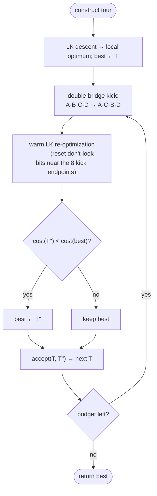

# Chained Lin–Kernighan — Level 4: Undergraduate CS

> **Example problems:** Traveling Salesman Problem, Large-scale Vehicle Routing Problem  ·  **Type:** Heuristic (improvement)  ·  **Guarantee:** No formal bound; often extremely close to optimal
> **Used for:** Restarting Lin–Kernighan from perturbed tours for large-scale, very-high-quality solving
> **Level 4 of 6** — undergrad: the ILS template, the double bridge, pseudocode, complexity, mermaid flow. See sibling files for other levels.

---

## Problem statement

Chained Lin–Kernighan (chained LK, a.k.a. **iterated LK**) wraps the LK local search in an **iterated local search (ILS)** loop to escape LK local optima. It alternates a structure-preserving **perturbation** (the **double-bridge** 4-opt move) with a full **LK re-optimization**, accepting under a chosen rule. It is the standard way to obtain very-high-quality TSP tours at scale.

## The iterated local search (ILS) template

```
s0  ← Construct()                  # initial tour
s   ← LocalSearch(s0)              # LK descent to a local optimum
best ← s
repeat:
    s' ← Perturb(s)               # double-bridge kick
    s''← LocalSearch(s')          # LK re-optimization
    s  ← Accept(s, s'')           # acceptance criterion
    if cost(s'') < cost(best): best ← s''
until budget exhausted
return best
```

Three design choices define the instance: **LocalSearch** = LK; **Perturb** = double bridge; **Accept** = better-only (or a Metropolis-style rule). Chained LK is exactly this template with those choices.

## The double bridge — why this perturbation

Cut four edges splitting the tour into consecutive segments `A,B,C,D` and reconnect as `A·C·B·D`. Three properties make it the canonical kick:

1. **Outside LK's reach.** It is a **non-sequential 4-opt** move: no single sequential LK exchange (nor any 2-/3-opt move) produces or undoes it. So LK will *not* immediately walk the kick back — the perturbation sticks.
2. **Structure-preserving.** All four segments stay intact; only their order changes. The kicked tour is "close" to the original, so LK re-optimizes quickly from a good basin rather than from scratch.
3. **Fixed, tiny cost to apply.** Choosing 3 random cut points (the 4th is the wrap) and splicing is `O(1)`–`O(n)`; no search needed.

This is the sweet spot between **too weak** (LK reverses it; you stay in the same local optimum) and **too strong** (equivalent to random restart; you lose all accumulated structure).

## Acceptance criteria

- **Better-only (`accept if cost(s'') < cost(s)`):** aggressive descent; `s` follows the best. Simple, strong on TSP.
- **Random-walk (`always accept`):** maximal exploration; rarely best alone.
- **Restart-threshold / Metropolis (`accept worse with prob e^{−Δ/T}`):** a middle ground borrowing the simulated-annealing idea — keeps exploring without drifting too far. Often "accept if within `ε` of best, else revert to best."

The classic chained-LK setting walks from the current solution but always tracks `best`; LKH variants use restart thresholds.

## Pseudocode (chained LK)

```
CHAINED_LK(V, d, maxIters):
    T ← construct(V, d)                 # e.g. greedy / space-filling-curve
    T ← LK(T, d)                        # initial LK local optimum
    best ← T
    for it in 1..maxIters:
        T' ← double_bridge(T)           # pick 3 cut points; reconnect A·C·B·D
        T''← LK(T', d)                  # re-optimize (warm: only near the kick is dirty)
        if cost(T'') < cost(best):
            best ← T''
        T  ← accept(T, T'')             # e.g. T'' if better else T  (better-only)
    return best

double_bridge(T):
    pick 1 ≤ p < q < r < n              # 3 interior cut points → segments A,B,C,D
    return A · C · B · D                # swap the two middle segments
```

**Warm-start optimization:** after a double bridge only the **8 endpoints** of the four broken/added edges change locally. Resetting **don't-look bits** for just those cities makes the follow-up LK re-optimize in roughly the perturbed region instead of scanning the whole tour — the key to making millions of iterations affordable.

## Complexity

- **Per iteration:** one double bridge (`O(1)` to choose, `O(n)` to splice with arrays / `O(√n)`–`O(log n)` with a two-level structure) + one **warm LK** (near-local cost, far below a from-scratch LK because only the kicked region is "dirty").
- **Total:** `maxIters ×` (warm-LK cost). Tunable to any time budget; quality improves roughly monotonically with iterations.
- **Space:** `Θ(n)` working + neighbor/candidate lists, same as LK.

## Control flow



## Where it sits

Chained LK is the **capstone of the local-search cluster**: it takes the best descent method (LK) and adds the one ingredient LK lacks — a way out of local optima — using exactly the **double-bridge** move that 2-opt, 3-opt, and LK structurally cannot make. Viewed from above, it is the **TSP-specialized instance of iterated local search**, one of several "how to escape a local optimum" strategies; the *next* cluster — simulated annealing, tabu search, genetic algorithms, GRASP, VNS — are alternative answers to the same question.

## One-line summary

Iterated local search = **double-bridge kick + LK re-optimization + keep-the-better**, warm-started so each of millions of iterations is cheap — the practical state of the art (<1%, often optimal) and the bridge from local search to the metaheuristics family.

