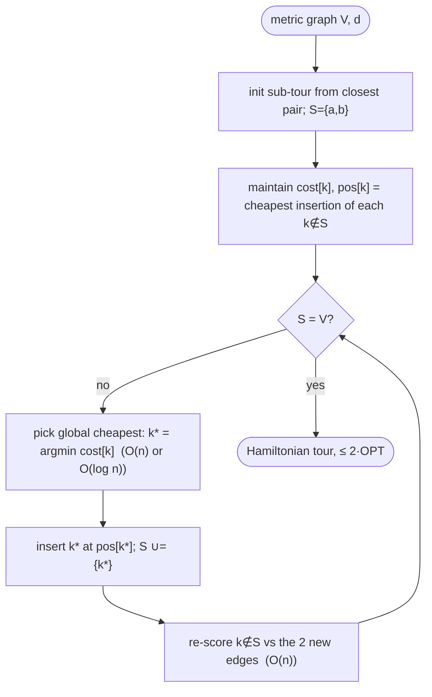

# Cheapest insertion — Level 4: Undergraduate CS

> **Example problems:** Traveling Salesman Problem, Vehicle Routing Problem, Logistics route construction  ·  **Type:** Heuristic (constructive)  ·  **Guarantee:** No formal bound in general
> **Used for:** Growing a tour by always making the globally cheapest insertion
> **Level 4 of 6** — undergrad: precise statement, pseudocode, Big-O, the 2-approximation, mermaid flow. See sibling files for other levels.

---

## Problem statement

TSP on `(V, d)`, `|V| = n`. **Cheapest insertion** is the insertion-family member whose **selection** rule is "minimum insertion cost." It keeps a sub-tour (a cycle on `S ⊆ V`) and at each step inserts the (vertex, position) pair that minimizes the joint insertion cost:

```
choose (k*, (i*,j*)) = argmin_{k ∉ S, (i,j) ∈ edges(T)}  c(i,k,j),
  where  c(i,k,j) = d(i,k) + d(k,j) − d(i,j)
```

Compare nearest insertion, which decomposes the decision (select `k` by `dist(k,S)`, *then* place at min cost). Cheapest insertion does **not** decompose — it minimizes over `k` and position **jointly**. On metric instances it is a **2-approximation**.

## Pseudocode

```
CHEAPEST_INSERTION(V, d):
    (a, b) ← argmin_{u≠v} d(u, v)
    tour ← cycle [a, b];  S ← {a, b}
    # cost[k] = cheapest insertion cost of k into the current tour
    # pos[k]  = the edge achieving it
    for k ∉ S: (cost[k], pos[k]) ← min over edges (i,j) of c(i,k,j)
    while S ≠ V:
        k* ← argmin_{k ∉ S} cost[k]          # global cheapest insertion
        insert k* at pos[k*];  S ← S ∪ {k*}
        # the insertion replaced edge (i*,j*) with (i*,k*) and (k*,j*):
        for k ∉ S:                            # update affected candidates
            recompute c against the two NEW edges; also try c(·, k*, ·);
            cost[k] ← min(old cost[k] consistent with removed edge, new options)
            update pos[k] accordingly
    return tour
```

The bookkeeping subtlety: inserting `k*` deletes one edge and adds two, so each outside vertex's best position may change. The clean implementation keeps, per outside vertex, its cheapest insertion cost and re-evaluates it against the two new edges each step (and discards positions on the removed edge).

## Complexity

- **Naïve** (rescore all `k ∉ S` against all `O(|S|)` edges each step): `Σ_{|S|} O(n·|S|) = O(n³)`.
- **With per-vertex best-cost caching** (only re-check the 2 new edges per insertion): each insertion updates `O(n)` vertices in `O(1)` each ⇒ `O(n²)` total, plus an `O(n)` argmin per step (or `O(log n)` with a priority queue) ⇒ **`Θ(n²)`** time, `Θ(n²)` space (matrix).
- So cheapest insertion matches nearest insertion's `Θ(n²)` with a **larger constant** (it tracks a best *position*, not just a best *distance*).

## The 2-approximation theorem (metric)

**Theorem (RSL 1977).** For metric TSP, cheapest insertion returns a tour of cost `≤ 2·OPT`.

**Proof idea.** The bound rides on the same MST argument as nearest insertion:
1. **Cheapest ≤ nearest, pointwise per step in the bound.** The cheapest insertion available is **no more expensive** than the specific insertion nearest insertion would make (inserting the tour-nearest vertex beside its nearest neighbor). That bounding insertion costs `≤ 2·dist(k,S)` by the triangle inequality.
2. Summing the bounding insertions, `Σ 2·dist(k,S) = 2·cost(MST)` via the **Prim correspondence** (selecting the tour-nearest vertex mirrors Prim).
3. `MST ≤ OPT` (delete an edge from the optimal tour).

So `cost(tour) ≤ Σ_k c(k) ≤ Σ_k 2·dist(k,S) ≤ 2·cost(MST) ≤ 2·OPT`. ∎

Cheapest insertion's *actual* per-step cost is **≤** the bounding (nearest-style) insertion, so its tour is bounded by the same `2·OPT` — though its real choices, and resulting tour, generally differ.

## Why insertion cost is non-negative

`c(i,k,j) = d(i,k)+d(k,j)−d(i,j) ≥ 0` is the **triangle inequality** — the loop never shrinks on insertion, and the metric assumption is exactly what powers both the algorithm's sanity and the 2-bound. Non-metric inputs void the guarantee.

## Control flow



## Insertion family at a glance (selection rule varies; placement always cheapest)

| Heuristic | Selection rule | Metric bound |
|-----------|----------------|--------------|
| Nearest insertion | vertex nearest the tour | ≤ 2 |
| **Cheapest insertion** | vertex+position of smallest *insertion cost* | **≤ 2** |
| Farthest insertion | vertex farthest from the tour | no constant proven; `O(log n)` generic (empirically excellent) |
| Random insertion | random vertex | no constant proven; `O(log n)` generic; strong in practice |

## One-line summary

`Θ(n²)` metric-TSP **2-approximation** that, each step, makes the **globally cheapest** (vertex, position) insertion — the joint-minimization sibling of nearest insertion, same MST/Prim 2-bound, larger constant, and a common template for logistics route construction.

