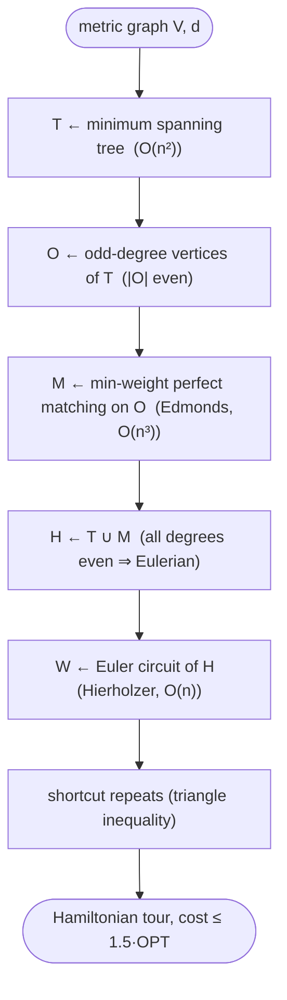

# Christofides–Serdyukov — Level 4: Undergraduate CS

> **Example problems:** Metric Traveling Salesman Problem, Vehicle Routing Problem, Logistics / delivery route planning  ·  **Type:** Approximation  ·  **Guarantee:** At most 1.5× optimal (metric TSP)
> **Used for:** Balanced quality/speed approximation with a worst-case bound
> **Level 4 of 6** — undergrad: precise statement, pseudocode, Big-O, the 3/2-approximation proof, control-flow diagram. See sibling files for other levels.

---

## Problem statement

**Metric TSP:** complete graph `K_n`, costs `d` symmetric, non-negative, satisfying the triangle inequality. Find a minimum-cost Hamiltonian cycle. Christofides–Serdyukov (Christofides 1976; Serdyukov 1978) is a polynomial **3/2-approximation** — it shares MST doubling's "Eulerian + shortcut" skeleton but uses a cheaper, smarter parity repair.

## Algorithm

```
CHRISTOFIDES(V, d):
    T  ← minimum spanning tree of (V, d)
    O  ← { v ∈ V : deg_T(v) is odd }              # |O| is even (handshake lemma)
    M  ← minimum-weight perfect matching of O      # in the complete graph on O, costs d
    H  ← multigraph T ∪ M                          # add matching edges to the tree
    # every vertex now has even degree ⇒ H is Eulerian
    W  ← Eulerian circuit of H (Hierholzer)
    tour ← vertices of W in order of first occurrence   # shortcut repeats
    return tour
```

Versus MST doubling, **only step "fix parity" changes**: doubling *all* tree edges → matching *only the odd-degree vertices*. Everything else (MST, Euler circuit, metric shortcut) is identical.

## Why the steps are valid

- **`|O|` is even.** The handshake lemma: `Σ_v deg_T(v) = 2(n−1)` is even, so the number of odd-degree vertices is even ⇒ a **perfect matching of `O` exists**.
- **`H = T ∪ M` is Eulerian.** Adding `M` raises each odd vertex's degree by exactly 1 (each is matched once) → even; even-degree vertices stay even. `H` is connected (contains the spanning tree `T`). Connected + all-even ⇒ Eulerian.
- **Shortcutting** yields a Hamiltonian cycle of no greater cost (triangle inequality), exactly as in MST doubling.

## Complexity

- **MST:** `O(n²)` (dense/complete graph) or `O(m log n)`.
- **Minimum-weight perfect matching** on `|O| ≤ n` vertices: the **bottleneck** — Edmonds' blossom algorithm, `O(n³)` (modern implementations `O(n³)`; the matching is on the complete graph over `O`).
- **Euler circuit (Hierholzer):** `O(|E_H|) = O(n)`. **Shortcutting:** `O(n)`.
- **Total: `O(n³)`**, dominated by the matching — slower than MST doubling's `O(n²)`, the price for the better bound. Still polynomial, still vastly faster than exact methods.

## Correctness: the 3/2-approximation theorem

**Theorem.** For metric TSP, `cost(CHRISTOFIDES) ≤ (3/2)·OPT`.

**Proof.** Let `OPT` be the optimal tour cost.
1. **`cost(T) ≤ OPT`.** Deleting an edge from the optimal tour gives a spanning path ⊇ a spanning tree, so the MST is at most that: `cost(T) ≤ OPT`.
2. **`cost(M) ≤ OPT/2`.** Consider the optimal tour `C*` restricted to the odd-degree set `O` — i.e. visit the vertices of `O` in the cyclic order they appear on `C*`. By the triangle inequality this "shortcut tour on `O`" has cost `≤ cost(C*) = OPT`. It is a cycle on an even number `|O|` of vertices, so its edges split into **two disjoint perfect matchings** of `O` (alternate edges). Their costs sum to `≤ OPT`, so the **cheaper** one costs `≤ OPT/2`. The *minimum-weight* matching `M` is no costlier than that: `cost(M) ≤ OPT/2`.
3. **Combine.** `cost(H) = cost(T) + cost(M) ≤ OPT + OPT/2 = (3/2)OPT`, and shortcutting the Euler circuit of `H` does not increase cost. Hence `cost(tour) ≤ (3/2)OPT`. ∎

**Tightness:** the 3/2 ratio is tight for this algorithm — instances exist where it approaches `(3/2)·OPT`. Improving the *constant* required entirely new ideas (unbeaten 1976→2021).

## Control flow



## Christofides vs MST doubling, side by side

| | MST doubling | Christofides |
|---|---|---|
| Parity fix | duplicate **all** tree edges | min-weight matching on **odd** vertices |
| Added cost bound | `≤ cost(T) ≤ OPT` | `≤ OPT/2` |
| Ratio | 2 | **3/2** |
| Bottleneck | MST, `O(n²)` | matching, `O(n³)` |

## Guarantee, in one line

Polynomial `O(n³)` metric-TSP **3/2-approximation**: MST (≤OPT) + min-weight matching on odd vertices (≤OPT/2) → Eulerian → Euler circuit → shortcut ⇒ tour ≤ 1.5·OPT; the long-standing best constant, beating MST doubling by replacing crude doubling with a targeted matching.
