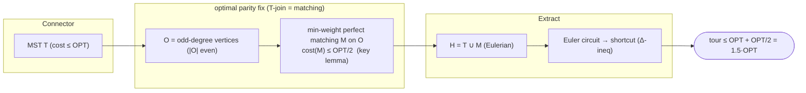

# Christofides–Serdyukov — Level 5: Graduate

> **Example problems:** Metric Traveling Salesman Problem, Vehicle Routing Problem, Logistics / delivery route planning  ·  **Type:** Approximation  ·  **Guarantee:** At most 1.5× optimal (metric TSP)
> **Used for:** Balanced quality/speed approximation with a worst-case bound
> **Level 5 of 6** — graduate: formal analysis, the parity paradigm, tightness, the matching ≤ OPT/2 lemma, edge cases, optimizations. See sibling files for other levels.

---

## 1. Formal setting and the parity paradigm

**Metric TSP** on `(V, d)`, `d` a metric. Christofides–Serdyukov instantiates the **"spanning connector → Eulerian parity correction → shortcut"** paradigm (shared with MST doubling), and is the canonical demonstration that the *quality of the parity correction* governs the approximation ratio.

A graph admits an Eulerian circuit iff it is connected and **every vertex has even degree** (Euler). A tour is itself a 2-regular Eulerian graph; the MST is connected and cheap (`≤ OPT`) but has the wrong parity at its odd-degree vertices `O`. The algorithmic question is: *what is the cheapest set of edges whose addition makes all degrees even?* This is a **T-join** problem (a `T`-join is an edge set whose odd-degree vertices are exactly `T`; here `T = O`). The minimum `O`-join in a metric is realized by a **minimum-weight perfect matching on `O`** — and bounding that matching is the whole game.

## 2. The two parity fixes, contrasted

| Parity correction | Object | Cost bound | Ratio |
|---|---|---|---|
| **Doubling** (MST doubling sibling) | duplicate every MST edge (a trivial `O`-join: doubling makes all degrees even) | `cost = cost(T) ≤ OPT` | `1 + 1 = 2` |
| **Christofides** | minimum-weight perfect matching on `O` (the *optimal* `O`-join) | `cost(M) ≤ OPT/2` | `1 + 1/2 = 3/2` |

Both add a connected-tree cost (`≤ OPT`) plus a parity-fix cost; Christofides simply pays the *minimum* parity-fix cost rather than a crude one, and that minimum is provably `≤ OPT/2`.

## 3. The key lemma, proved carefully

**Lemma.** For metric `(V,d)`, optimal tour value `OPT`, and `O ⊆ V` with `|O|` even, the minimum-weight perfect matching `M` on `O` satisfies `cost(M) ≤ OPT/2`.

**Proof.** Let `C*` be an optimal Hamiltonian cycle, `cost(C*) = OPT`. Project `C*` onto `O`: traverse `C*` and record the vertices of `O` in the cyclic order encountered, forming a cycle `C_O` on the `|O|` odd vertices whose consecutive edges are the `C*`-paths between successive `O`-vertices, shortcut to direct edges. By the triangle inequality each such direct edge costs `≤` the corresponding `C*`-subpath, so `cost(C_O) ≤ cost(C*) = OPT`. Since `|O|` is even, the edges of the cycle `C_O` 2-color into two perfect matchings `M₁, M₂` of `O` (alternate edges), with `cost(M₁) + cost(M₂) = cost(C_O) ≤ OPT`. Hence `min(cost(M₁), cost(M₂)) ≤ OPT/2`, and the minimum-weight matching `M` satisfies `cost(M) ≤ min(cost(M₁),cost(M₂)) ≤ OPT/2`. ∎

**Main theorem.** `cost(ALG) ≤ cost(T) + cost(M) ≤ OPT + OPT/2 = (3/2)OPT` (shortcutting non-increasing by the triangle inequality). ∎

## 4. Tightness

The 3/2 bound is **tight for the algorithm**: there are metric instances where MST + matching + shortcut `→ (3/2 − o(1))·OPT`. A standard construction uses `2k+1` vertices arranged so the MST is a path, all internal forced parity corrections are long, and the matching is compelled to use near-`OPT/2` weight while the tree uses near-`OPT`. So the analysis is exactly aligned with the algorithm's worst case — the ratio is not a loose bound. Improving the constant required fundamentally different techniques (LP-based, randomized; see Level 6), not a sharper analysis of this procedure.

## 5. Annotated pseudocode

```
CHRISTOFIDES(V, d):                                # d a metric
    T ← PRIM(V, d)                                 # MST, O(n²); cost(T) ≤ OPT
    O ← { v : deg_T(v) odd }                       # |O| even (Σ deg = 2(n−1))
    # minimum-weight perfect matching on the complete graph over O, weights d
    M ← EDMONDS_MIN_WEIGHT_PERFECT_MATCHING(O, d)  # O(|O|³) ≤ O(n³)  — bottleneck; cost(M) ≤ OPT/2
    H ← multigraph(T) ; H.add_edges(M)             # H Eulerian: connected ∧ all degrees even
    W ← HIERHOLZER(H)                              # Euler circuit, O(|E_H|) = O(n)
    seen ← ∅ ; tour ← [ ]
    for x in W:                                    # metric shortcut
        if x ∉ seen: tour.append(x); seen.add(x)
    return tour                                    # cost ≤ (3/2)·OPT
```



## 6. Edge cases, invariants, optimizations

- **Metric required.** Without the triangle inequality both the matching lemma (uses Δ-ineq on the `O`-projection) and shortcutting fail; the 3/2 bound is void. Take the metric closure (all-pairs shortest paths) if the input is a general non-negative weighted graph.
- **Asymmetric TSP:** inapplicable — matching/Euler arguments need symmetry; ATSP uses different machinery (constant-factor only since 2018).
- **Matching is the bottleneck and the fragile part:** Edmonds' blossom is `O(n³)`; in practice this dominates runtime and implementation complexity (far harder than MST). Approximate/decomposed matching speeds it up at the cost of the guarantee.
- **Invariant:** after adding `M`, `deg_H(v)` even for all `v` and `H ⊇ T` connected ⇒ Eulerian — the precondition for step 5, always met.
- **Christofides as a seed:** like MST doubling, the output is an excellent *initial* tour for **2-opt / Or-opt / Lin–Kernighan**; the construction+local-search pipeline routinely reaches <2–3% of optimal on real instances.
- **Best-of-many shortcutting:** different Euler traversals / start vertices give different tours, all ≤ 3/2·OPT; keep the cheapest.
- **Christofides–Serdyukov naming:** Christofides (1976, CMU report) and Serdyukov (1978, independently in the USSR) discovered it separately; modern literature credits both.

**Synthesis:** Christofides–Serdyukov keeps MST doubling's connector-and-shortcut frame but replaces the crude "double everything" parity fix with the **optimal** one — a minimum-weight perfect matching on the odd-degree vertices (the minimum `O`-join). The single lemma `cost(M) ≤ OPT/2` (via 2-coloring the optimal tour's projection onto `O`) drops the ratio from 2 to 3/2. The analysis is tight, the runtime `O(n³)` (matching-bound), and the result stood as the best metric-TSP approximation for 45 years — the high-water mark of classical combinatorial approximation before LP/randomized methods inched below it.
