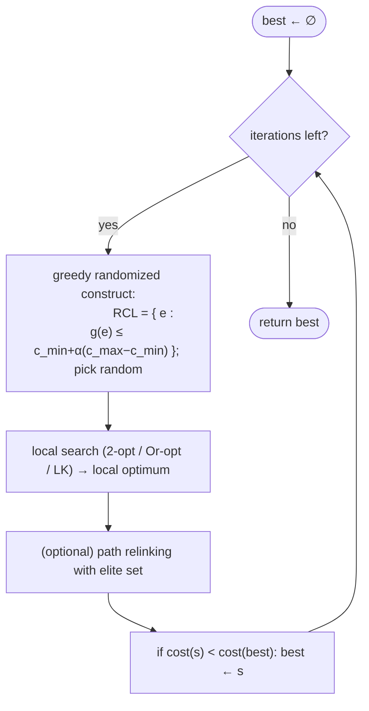

# GRASP — Level 4: Undergraduate CS

> **Example problems:** Traveling Salesman Problem, Set covering, Scheduling  ·  **Type:** Metaheuristic  ·  **Guarantee:** No guarantee; multi-start greedy + local search
> **Used for:** Multi-start randomized-greedy construction followed by local search
> **Level 4 of 6** — undergrad: precise statement, RCL, pseudocode, path relinking, complexity, mermaid. See sibling files for other levels.

---

## Problem statement

GRASP — **Greedy Randomized Adaptive Search Procedure** (Feo & Resende 1989/1995) — is a **multi-start metaheuristic**. Each iteration independently (1) **constructs** a solution with a randomized-greedy rule, then (2) applies **local search**; the best over all iterations is returned. It has effectively **no continuous parameters** beyond the RCL setting and the iteration budget, and its iterations are **embarrassingly parallel**.

## Phase 1 — greedy randomized construction (the RCL)

Build a solution element-by-element. At each step, with a greedy function `g(e)` scoring each candidate element `e` (for TSP, `g` = length of the next edge):

```
c_min = min_e g(e);   c_max = max_e g(e)
RCL = { e : g(e) ≤ c_min + α·(c_max − c_min) }       # value-based RCL, α ∈ [0,1]
e*  = random element of RCL                           # random pick
```

- `α = 0` ⇒ pure greedy (RCL = best element only) ⇒ deterministic.
- `α = 1` ⇒ pure random (RCL = all candidates).
- **Adaptive:** `g` is **recomputed each step** as the partial solution grows (the "A" in GRASP).
- **Cardinality-based RCL** is the alternative: keep the best `p` candidates regardless of value.

## Phase 2 — local search

Construction yields a feasible but unpolished solution; **local search** (2-opt / Or-opt / Lin–Kernighan for TSP) descends it to a local optimum. Construction quality matters: a good RCL puts local search in a strong basin, reducing its work and improving the result.

## Pseudocode

```
GRASP(V, d, maxIter, alpha):
    best ← null
    for it in 1..maxIter:
        s ← GREEDY_RANDOMIZED_CONSTRUCT(V, d, alpha)
        s ← LOCAL_SEARCH(s, d)                 # 2-opt / Or-opt / LK
        if best = null or cost(s) < cost(best): best ← s
    return best

GREEDY_RANDOMIZED_CONSTRUCT(V, d, alpha):
    s ← [ random start city ]
    while s not complete:
        evaluate g(e) for each candidate next-city e          # adaptive: depends on s
        c_min, c_max ← min/max of g
        RCL ← { e : g(e) ≤ c_min + alpha·(c_max − c_min) }
        add random(RCL) to s
    return s
```

## Path relinking — adding the missing memory

Plain GRASP's weakness is that iterations are **independent** (memoryless): it never reuses good solutions. **Path relinking (PR)** fixes this by maintaining an **elite set** of good solutions and, for a new solution `s`, exploring the trajectory of intermediate solutions between `s` and an elite guide `t` (stepwise transforming `s` into `t`, keeping the best solution on the path). **GRASP+PR** is the standard high-performance form — it injects cross-iteration learning, moving GRASP toward the intensification of tabu search/scatter search.

## Complexity

- **Per iteration:** construction `O(n²)` (each of `n` steps scores `O(n)` candidates; candidate lists reduce this) + local search (dominant: a 2-opt/LK descent).
- **Total:** `O(maxIter · (construction + localSearch))`, fully **parallel** across iterations.
- **Space:** `O(n²)` matrix + `O(n)` per solution (+ elite set for PR).

## Control flow



## Where it sits

GRASP is the **randomized-restart** single-solution metaheuristic. Its relationships to the rest of the registry are tight:
- Its **construction** is a randomized constructive heuristic — randomized **nearest neighbor** / **greedy-edge** / **insertion** (the constructive cluster), and the **memoryless** cousin of **ant colony optimization** (which adds a *learned* pheromone bias to the same construction step).
- It is **iterated local search with the incumbent-reuse removed**: independent restarts instead of perturbing one solution. **Path relinking** restores cross-iteration memory.
- Its multi-start diversity is the same idea as **random/farthest insertion** seed ensembles.

## One-line summary

Multi-start metaheuristic: each iteration **builds** a solution by randomized-greedy choice from a **Restricted Candidate List**, then **local-searches** it, keeping the best over many independent (parallelizable) restarts — simple, broad, memoryless (until **path relinking** adds memory), with no guarantee.

