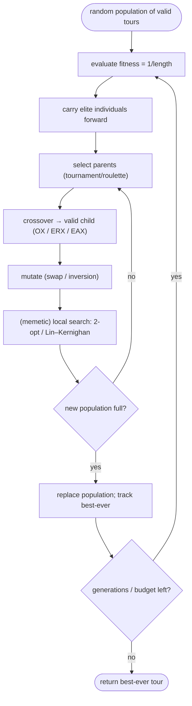

# Genetic algorithm / evolutionary algorithm — Level 4: Undergraduate CS

> **Example problems:** Traveling Salesman Problem, Job scheduling, Knapsack / feature selection, Hyperparameter / architecture search  ·  **Type:** Metaheuristic  ·  **Guarantee:** No guarantee; stochastic
> **Used for:** Population-based global search via selection, crossover, and mutation
> **Level 4 of 6** — undergrad: precise statement, operators, TSP crossovers, pseudocode, complexity, mermaid. See sibling files for other levels.

---

## Problem statement

A genetic algorithm (GA) is a **population-based metaheuristic** minimizing a cost `E(s)` by evolving a set of encoded solutions ("chromosomes") under **selection**, **crossover**, and **mutation**. "Evolutionary algorithm" (EA) is the umbrella term (GA, evolution strategies, evolutionary programming, genetic programming, differential evolution). For TSP, a chromosome is a **permutation** of cities (a tour) and **fitness** is a decreasing function of tour length (e.g. `1/length` or `−length`).

## The four operators

- **Encoding.** Permutation (path representation) for TSP. The encoding dictates which crossovers are legal.
- **Selection.** Choose parents biased toward fitness:
  - *Roulette-wheel* (fitness-proportional): `P(i) = f_i / Σ f_j`.
  - *Tournament*: pick `k` at random, keep the best — the common default (robust, scale-free).
  - *Rank* selection: probabilities from fitness rank, not raw value (avoids domination by outliers).
- **Crossover.** Recombine two parents into valid children (see below).
- **Mutation.** Small random change for diversity: *swap*, *insertion*, or *inversion* (inversion = a 2-opt move). Low rate (≈1–5%).
- **Replacement.** *Generational* (children replace parents) vs *steady-state* (replace a few each step); **elitism** carries the best `e` individuals forward unchanged.

## TSP-specific crossovers (validity is the whole problem)

A naive one-point crossover on permutations produces illegal tours (repeated/missing cities). Standard fixes:

| Crossover | Inherits | Idea |
|-----------|----------|------|
| **Order (OX)** | relative order | copy a window from P1; fill rest in P2's order, skipping duplicates |
| **PMX** (partially mapped) | positions | copy a window; repair conflicts via a position mapping |
| **Cycle (CX)** | absolute positions | build position-cycles between parents |
| **Edge Recombination (ERX)** | **edges** | build an adjacency list from both parents; greedily extend by fewest remaining neighbors |
| **Edge Assembly (EAX)** | **edges** (SOTA) | combine parents' edge sets via alternating cycles; the strongest TSP crossover |

The high-performing crossovers (ERX, EAX) inherit **edges**, not positions — because tour length is a function of edges. This is the key TSP-specific insight.

## Pseudocode

```
GENETIC_ALGORITHM(E, popSize, generations, pc, pm, elite):
    P ← popSize random valid tours
    evaluate fitness of all P
    repeat generations times:
        P' ← top `elite` individuals of P            # elitism
        while |P'| < popSize:
            p1, p2 ← select(P), select(P)            # tournament/roulette
            if random() < pc: c ← crossover(p1, p2)  # OX / ERX / EAX → valid tour
            else            : c ← copy(p1)
            if random() < pm: c ← mutate(c)          # swap / inversion (2-opt move)
            # --- memetic option: c ← localSearch(c) (2-opt / Lin–Kernighan) ---
            add c to P'
        P ← P'
        evaluate fitness; track best-ever
    return best-ever
```

## Memetic algorithms (the version that wins on TSP)

A **memetic algorithm** = GA + **local search applied to each individual** (the commented line above). Each child is improved to a local optimum (2-opt, Or-opt, or **Lin–Kernighan**) before entering the population, so the GA evolves over the space of *local optima* — exactly the space chained Lin–Kernighan also searches, but with **recombination** instead of perturbation as the escape mechanism. Memetic GAs with edge-based crossover (EAX) + LK are competitive with the best TSP solvers; plain GAs are not.

## Complexity (per generation)

- **Evaluation:** `O(popSize · n)` to compute tour lengths (incremental for children).
- **Selection:** `O(popSize)` (tournament) or `O(popSize)` with prefix sums (roulette).
- **Crossover:** `O(n)` per child (ERX/EAX a bit more for adjacency bookkeeping).
- **Mutation:** `O(1)`–`O(n)`.
- **Memetic local search:** dominant term — each child costs a full 2-opt/LK descent.
- **Total:** `O(generations · popSize · (n + localSearchCost))`. Space `O(popSize · n)`. Runtime is budget-driven and trivially **parallel** across the population.

## Control flow



## Where it sits

GA is the first **population-based** metaheuristic here — its escape mechanism is **recombination across a population**, contrasting with SA's probabilistic uphill acceptance (single trajectory). Its sibling **ant colony optimization** is also population-based (but constructs solutions from pheromone, not crossover); **tabu search**, **GRASP**, and **VNS** are single-solution. On TSP, GA matters chiefly in its **memetic** form, which is the bridge back to the local-search cluster.

## One-line summary

A population-based metaheuristic that evolves valid tours via fitness **selection**, edge-aware **crossover** (OX/ERX/EAX), and **mutation** — generic across domains, weak as a plain GA on TSP but state-of-the-art in **memetic** form (EAX + Lin–Kernighan), with recombination as its local-optimum escape mechanism.

