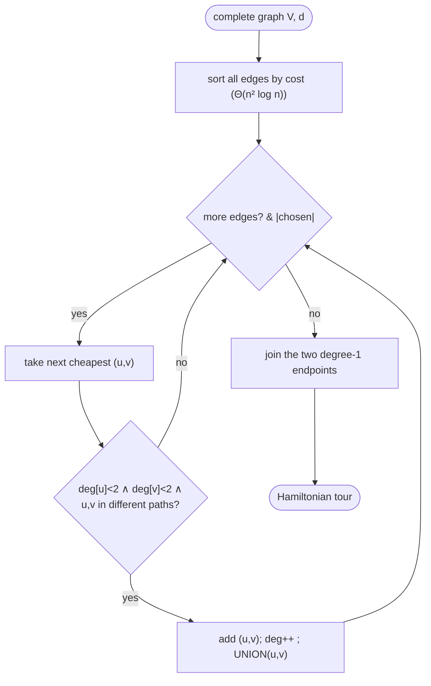

# Greedy edge-selection (cheapest link) — Level 4: Undergraduate CS

> **Example problems:** Traveling Salesman Problem, Vehicle Routing Problem, Circuit / cable layout  ·  **Type:** Heuristic (constructive)  ·  **Guarantee:** No guarantee; depends on instance
> **Used for:** Constructing a tour by adding cheapest valid edges first
> **Level 4 of 6** — undergrad: precise statement, pseudocode, Big-O, the (lack of) guarantee, control-flow diagram. See sibling files for other levels.

---

## Problem statement

TSP on a complete graph `(V, d)`, `|V| = n`. The **greedy edge / cheapest-link** heuristic builds a Hamiltonian cycle by scanning edges in nondecreasing cost order and adding each edge iff it keeps the partial solution extendable to a tour. It is a **constructive heuristic** with **no approximation guarantee** — a close cousin of Kruskal's MST algorithm, but with degree and cycle constraints adapted for a *tour* rather than a tree.

## The feasibility invariant

A set of chosen edges can be completed into a Hamiltonian cycle iff it is a **disjoint union of simple paths** (a "linear forest"): equivalently,
- every vertex has **degree ≤ 2**, and
- there is **no cycle**, *except* the single full Hamiltonian cycle formed by the very last (`n`-th) edge.

So an edge `(u,v)` is **accepted** iff: `deg(u) < 2`, `deg(v) < 2`, and `u, v` are not already endpoints of the *same* path (which would close a premature subtour) — unless this is the final edge joining the last two endpoints into the complete tour.

## Pseudocode

```
CHEAPEST_LINK(V, d):
    E ← all edges sorted by nondecreasing d                  # Θ(n² log n)
    deg ← array[n] of 0
    uf  ← Union-Find over V                                  # tracks path-endpoints connectivity
    chosen ← [ ]
    for (u, v) in E:                                          # cheapest first
        if deg[u] < 2 and deg[v] < 2 and FIND(uf,u) ≠ FIND(uf,v):
            chosen.append((u,v)); deg[u]++; deg[v]++
            UNION(uf, u, v)
            if |chosen| == n − 1: break                      # n−1 edges = one Hamiltonian path
    # close the tour: connect the two remaining degree-1 endpoints
    (a, b) ← the two vertices with deg == 1
    chosen.append((a, b))
    return chosen                                             # the Hamiltonian cycle
```

The Union–Find condition `FIND(u) ≠ FIND(v)` forbids closing a cycle early (same as Kruskal); the `deg < 2` checks forbid degree-3 vertices. After `n−1` accepted edges the chosen set is a single Hamiltonian *path*; the explicit closing edge between its two endpoints makes the cycle.

## Complexity

- **Sorting `Θ(n²)` edges:** `Θ(n² log n)` — the dominant term.
- **Scan with Union–Find:** each edge does `O(α(n))` (inverse-Ackermann, effectively constant) work ⇒ `O(n² α(n))`.
- **Total: `Θ(n² log n)`** time, `Θ(n²)` space (edge list) or `Θ(n)` if edges are generated/streamed. Slightly costlier than nearest neighbor's `Θ(n²)` due to the sort, still polynomial and fast.

## Guarantees

- **No constant-factor guarantee.** Like nearest neighbor, greedy edge-selection has worst-case metric ratio `Θ(log n)` (Rosenkrantz–Stearns–Lewis 1977 analyze both); it is **not** a constant approximation. The myopic global-cheapest commitments can force expensive edges when stitching leftover path-fragments at the end.
- **Non-metric:** unbounded.
- Empirically it is *comparable to or slightly better than* nearest neighbor on random Euclidean instances (often ~10–15% over optimal), but with the same lack of worst-case promise.

## Correctness (produces a valid tour) & termination

- **Termination:** the edge list is finite; the loop ends after scanning it (or early at `n−1` accepted edges).
- **Validity:** the invariant guarantees the chosen edges always form a linear forest; after `n−1` acceptances it is a single Hamiltonian path (it must be connected and acyclic with all-but-two vertices at degree 2), and the closing edge yields a Hamiltonian cycle. On a complete graph this always succeeds; on an incomplete graph the greedy choices can deadlock (no legal edge remains to finish) — a known limitation requiring a complete/metric-closure input.

## Control flow



## Relation to Kruskal's MST

Identical skeleton — sort edges, add cheapest that doesn't violate the invariant, Union–Find to detect cycles — but the *invariant differs*: Kruskal forbids **all** cycles and allows any degree (building a tree); cheapest-link additionally caps **degree at 2** and allows exactly **one** final cycle (building a tour). MST is *provably optimal* because forests form a matroid; the tour constraint **breaks the matroid structure**, which is exactly why cheapest-link loses the optimality guarantee.

## Guarantee, in one line

`Θ(n² log n)` Kruskal-style tour constructor (sort edges, add cheapest keeping degree ≤ 2 and no early cycle) — always a valid tour, never guaranteed good (`Θ(log n)` worst case on metrics, unbounded otherwise); a fast seed comparable to nearest neighbor.
