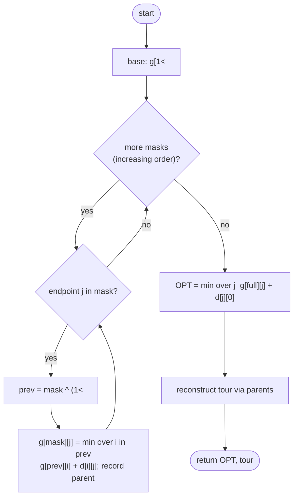

# Held–Karp dynamic programming — Level 4: Undergraduate CS

> **Example problems:** Traveling Salesman Problem, Shortest Hamiltonian path, Sequential ordering / scheduling with setup costs  ·  **Type:** Exact  ·  **Guarantee:** Optimal tour; time O(n^2·2^n)
> **Used for:** Exact solving and benchmarking for small–medium instances via subset DP
> **Level 4 of 6** — undergrad: precise recurrence, pseudocode, Big-O, correctness, control-flow diagram. See sibling files for other levels.

---

## Problem statement

Complete graph on `V = {0,…,n−1}`, cost `d: V×V → ℝ≥0`, distinguished start `0`. Find a minimum-cost Hamiltonian cycle. Held–Karp (Held & Karp 1962; independently Bellman 1962) solves it **exactly** by dynamic programming over **subsets of visited vertices**.

## The DP

Define, for a subset `S ⊆ {1,…,n−1}` and an endpoint `j ∈ S`:

```
g(S, j) = cost of the shortest path that starts at 0,
          visits every vertex in S exactly once, and ends at j.
```

**Base case** (singleton):
```
g({j}, j) = d(0, j)                       for each j ∈ {1,…,n−1}
```

**Recurrence** (the last hop before `j` comes from some `i ∈ S\{j}`, and the prefix must itself be optimal):
```
g(S, j) = min over i ∈ S\{j}  of  [ g(S\{j}, i) + d(i, j) ]        |S| ≥ 2
```

**Final answer** (close the tour back to `0` from the full set `F = {1,…,n−1}`):
```
OPT = min over j ∈ F  of  [ g(F, j) + d(j, 0) ]
```

To recover the tour, store `parent(S, j) = argmin i` alongside each `g`, then backtrack from the optimal final `j`.

## Bitmask encoding

Represent `S` as an `n`-bit integer (bit `k` set ⇔ vertex `k ∈ S`). Then `g` is a 2-D table `g[mask][j]`, subsets are integers `0…2ⁿ−1`, and "`S\{j}`" is `mask ^ (1<<j)`. Iterating masks in increasing numeric order guarantees every subset is processed *after* all its proper subsets (a subset's integer value is strictly smaller), so the DP fills in a valid topological order.

## Pseudocode

```
HELD_KARP(d, n):
    # vertex 0 is the fixed start; bits index vertices 1..n-1
    g    ← table[2^n][n] initialized to +∞
    par  ← table[2^n][n]                         # for tour reconstruction
    for j in 1 … n-1:                            # base cases
        g[1<<j][j] ← d[0][j]
    for mask in 1 … 2^n - 1:                     # increasing order ⇒ subsets first
        for j in 1 … n-1 with bit j set in mask:
            prev ← mask ^ (1<<j)
            if prev == 0: continue               # singleton handled by base case
            for i in 1 … n-1 with bit i set in prev:
                cand ← g[prev][i] + d[i][j]
                if cand < g[mask][j]:
                    g[mask][j] ← cand
                    par[mask][j] ← i
    full ← (2^n - 1) without bit 0  =  (1<<n) - 2
    OPT ← +∞ ; last ← -1
    for j in 1 … n-1:
        cand ← g[full][j] + d[j][0]
        if cand < OPT: OPT ← cand ; last ← j
    return OPT, RECONSTRUCT(par, full, last)

RECONSTRUCT(par, mask, j):
    tour ← []
    while j != -1 and mask != 0:
        tour.prepend(j)
        i ← par[mask][j]
        mask ← mask ^ (1<<j)
        j ← i
    return [0] + tour + [0]
```

## Complexity

- **Time:** `Θ(n² · 2ⁿ)` — there are `Θ(n·2ⁿ)` table cells `(mask, j)`, and each takes `Θ(n)` to minimize over the predecessor `i`.
- **Space:** `Θ(n · 2ⁿ)` for the `g` (and `par`) tables. **This dominates in practice** — the `2ⁿ` memory is the binding constraint, capping exact use around `n ≈ 20–25` on commodity hardware (e.g. n=25 → 25·2²⁵ ≈ 8×10⁸ cells).
- vs **brute force** `Θ(n!)`: `2ⁿ` beats `n!` decisively (`log(n!) = Θ(n log n)` vs `n`), so Held–Karp is exponentially faster while remaining exact.

## Correctness

- **Optimal substructure:** any shortest "start 0, visit `S`, end `j`" path whose penultimate vertex is `i` must use a shortest "visit `S\{j}`, end `i`" prefix — else substitute the cheaper prefix for a contradiction. The recurrence minimizes over all valid `i`, so it computes `g(S,j)` correctly given correct smaller entries.
- **Overlapping subproblems:** distinct full tours share `(S, j)` prefixes; the table computes each once.
- **Termination & order:** finitely many `(mask, j)`; processing masks in increasing integer order means `prev = mask ^ (1<<j) < mask` is already final when read. Induction on `|S|` gives global correctness; closing over `j` at the end adds the return edge.

## Control flow



## Guarantee, in one line

Exact optimum; `Θ(n²·2ⁿ)` time, `Θ(n·2ⁿ)` space — the textbook DP that pushes exact TSP from brute force's ~12 cities to ~20, memory-bound thereafter.
