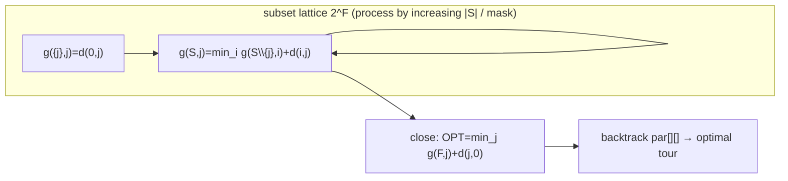

# Held–Karp dynamic programming — Level 5: Graduate

> **Example problems:** Traveling Salesman Problem, Shortest Hamiltonian path, Sequential ordering / scheduling with setup costs  ·  **Type:** Exact  ·  **Guarantee:** Optimal tour; time O(n^2·2^n)
> **Used for:** Exact solving and benchmarking for small–medium instances via subset DP
> **Level 5 of 6** — graduate: formal recurrence, paradigm, complexity derivation, proofs, variants, edge cases, optimizations. See sibling files for other levels.

---

## 1. Formal setting and the Bellman functional equation

Instance `(V, d)`, `|V| = n`, start `0`, `F = V\{0}`. Define the value function on the lattice of subsets `2^F` × endpoints:

```
g: {(S, j) : S ⊆ F, j ∈ S} → ℝ≥0,
g(S, j) = min { cost(P) : P a simple path 0 ⇝ j visiting exactly S }.
```

Bellman optimality equation:
```
g({j}, j) = d(0, j)
g(S, j)   = min_{i ∈ S\{j}}  g(S\{j}, i) + d(i, j),     |S| ≥ 2
OPT       = min_{j ∈ F}      g(F, j) + d(j, 0).
```

This is **dynamic programming over subsets** ("subset DP" / "Held–Karp DP"): the state augments the naive "current vertex" with the *set of visited vertices*, which is the minimal extra information that makes the future cost independent of the past (the Markov/optimal-substructure property). The set is necessary precisely because TSP's feasibility constraint (visit each vertex once) is non-local — a memoryless shortest-path DP would revisit vertices.

## 2. Why the subset is the right state (optimal substructure, proved)

**Claim.** `g(S,j)` as computed by the recurrence equals the true optimal `0⇝j` path-cost over exactly `S`.

**Proof (induction on |S|).** Base `|S|=1`: the only simple path visiting `{j}` from `0` is the edge `0→j`, cost `d(0,j)`. ✓
Inductive step: let `P*` be an optimal path realizing the true `g(S,j)`, and let `i` be its penultimate vertex. Deleting the final edge yields a path `P'` that visits exactly `S\{j}` and ends at `i`; `cost(P') = cost(P*) − d(i,j)`. If some path `Q` over `S\{j}` ending at `i` had `cost(Q) < cost(P')`, then `Q·(i→j)` would visit `S`, end at `j`, and cost less than `P*` — contradiction. So `cost(P') = g(S\{j}, i)`, which equals the recurrence's stored value by the inductive hypothesis. Hence `cost(P*) = g(S\{j}, i) + d(i,j) ≥ min_i [...]`. The reverse inequality holds because every `i ∈ S\{j}` yields a feasible path of cost `g(S\{j},i)+d(i,j)`. Equality follows. ∎

The exchange argument is exactly where TSP's structure (concatenating optimal sub-paths preserves feasibility once the visited-set is in the state) is used.

## 3. Complexity derivation and the exponential-DP paradigm

- States: `Σ_{k=1}^{n−1} C(n−1, k)·k = Θ(n · 2ⁿ)` pairs `(S, j)`.
- Transition: each minimizes over `|S\{j}| < n` predecessors ⇒ `O(n)`.
- **Time `Θ(n² 2ⁿ)`, space `Θ(n 2ⁿ)`.**

Held–Karp is the prototypical **`O*(2ⁿ)` exact exponential algorithm**: `log(n!) = Θ(n log n)` while `log(n² 2ⁿ) = Θ(n)`, so the DP is a genuine *exponential-class* improvement over brute force, not merely a constant factor (contrast the dihedral symmetry quotient, which is only `2n×`). It remains, six decades on, the **best known worst-case bound** for general TSP — improving the `2ⁿ` base is a marquee open problem (Level 6).

The binding resource is **space**: `Θ(2ⁿ)` memory exhausts before `Θ(n²2ⁿ)` time does, capping practical exact use near `n ≈ 20–25`.

## 4. Annotated pseudocode (engineering-grade)

```
HELD_KARP(d, n):
    INF ← +∞
    g   ← 2-D array [1<<n][n], filled INF          # g[mask][j]
    par ← 2-D array [1<<n][n], filled -1
    for j in 1 … n-1:
        g[1<<j][j] ← d[0][j]                        # base: 0 → j
    for mask in 1 … (1<<n)-1:                        # ascending ⇒ valid topo order
        if popcount(mask) < 2: continue
        sub ← mask
        while sub:                                   # iterate set bits = endpoints j
            j   ← lowbit_index(sub); sub &= sub-1
            prv ← mask ^ (1<<j)
            best ← INF; arg ← -1
            t ← prv
            while t:                                  # iterate predecessors i ∈ prv
                i ← lowbit_index(t); t &= t-1
                v ← g[prv][i] + d[i][j]
                if v < best: best ← v; arg ← i
            g[mask][j] ← best; par[mask][j] ← arg
    full ← (1<<n) - 2                                # all of 1..n-1, bit 0 clear
    OPT ← INF; last ← -1
    for j in 1 … n-1:
        v ← g[full][j] + d[j][0]
        if v < OPT: OPT ← v; last ← j
    return OPT, reconstruct(par, full, last)
```



## 5. Variants & optimizations

- **Bitmask + ascending-mask order** (Section 4): the standard cache-reasonable layout; `g[mask][j]` row-per-mask gives decent locality.
- **Gray-code / subset-sum enumeration:** iterate subsets so successive masks differ by one bit, enabling incremental updates in some formulations.
- **Path vs cycle:** dropping the final `+ d(j,0)` closure gives **shortest Hamiltonian path**; fixing endpoints fixes the base/closure accordingly. Free start *and* end → take `min_j g(F,j)`.
- **Asymmetric TSP:** the DP is **direction-aware already** (it tracks the *last* vertex and uses directed `d(i,j)`), so ATSP needs no change — a notable advantage over symmetry-exploiting or metric methods.
- **Memory reduction:** processing masks by increasing **popcount** lets you retain only layers `k−1` and `k`, but you still need `Θ(2ⁿ)` for the largest layer (`C(n−1, ⌊n/2⌋) ≈ 2ⁿ/√n`), so it is a constant-factor memory win only. For tour recovery without storing all parents, recompute by re-running the DP restricted to recovered suffixes, trading time for space.
- **Polynomial-space alternative:** abandon the DP table for an **inclusion–exclusion** counting/optimization of Hamiltonian paths (Kohn et al. 1977; Karp 1982), `O*(2ⁿ)` time in **polynomial space** — strictly dominating Held–Karp on space (Level 6).
- **Pruning hybrids:** Held–Karp also names a celebrated **lower bound** (the 1-tree / Lagrangian relaxation bound, Held & Karp 1970/71) used inside branch-and-bound — distinct from this DP but same authors; don't conflate the two.

## 6. Edge cases & invariants

- **`n ≤ 2`:** trivial; guard the base/closure.
- **Disconnected / `∞` edges:** unreachable transitions stay `INF`; `OPT = INF` certifies no Hamiltonian cycle exists — the DP doubles as an **exact Hamiltonicity decision** procedure.
- **Non-metric, negative-free `d`:** exact regardless — no triangle inequality assumed (unlike Christofides). Negative edges are fine for the *path-cost* DP as long as you want simple paths (the visited-set forbids revisits, so no negative-cycle issue).
- **Invariant:** when `g[mask][j]` is finalized, it is the exact optimum over exactly the vertex set `mask` ending at `j`; the ascending-mask order guarantees all reads `g[prev][·]` are already final.

**Synthesis:** Held–Karp lifts shortest-path DP to TSP by carrying the *visited set* in the state — the minimal augmentation that restores optimal substructure under the visit-once constraint. The price is one DP cell per `(subset, endpoint)`: `Θ(2ⁿ)` of them. That buys an exponential-class speedup over brute-force enumeration (`2^{Θ(n)}` vs `2^{Θ(n log n)}`) and remains the best known worst-case exact bound for general TSP — the exact frontier then advances not by a better bound but by *pruning* (branch-and-bound / branch-and-cut, Concorde).
