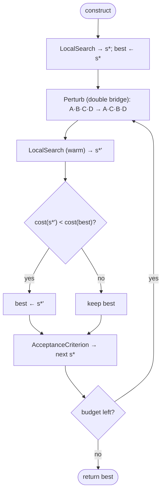

# Iterated local search — Level 4: Undergraduate CS

> **Example problems:** Traveling Salesman Problem, Scheduling, Quadratic assignment  ·  **Type:** Metaheuristic  ·  **Guarantee:** No guarantee; layered on local search
> **Used for:** Repeatedly perturbing then re-optimizing a local optimum
> **Level 4 of 6** — undergrad: the ILS template, perturbation/acceptance, pseudocode, complexity, mermaid. See sibling files for other levels.

---

## Problem statement

Iterated local search (ILS) is a **single-solution metaheuristic** that searches the space of **local optima** of a subordinate local search. From a local optimum `s*`, it applies a **perturbation** to get `s'`, runs **LocalSearch** to a new local optimum `s*'`, and **accepts** by a rule, repeating under a budget. It is a minimal, highly effective framework; **chained Lin–Kernighan** is its TSP instantiation (LocalSearch = LK, Perturb = double bridge).

## The template (three plug-ins + one)

```
s0   ← GenerateInitialSolution()
s*   ← LocalSearch(s0)
repeat:
    s'   ← Perturb(s*, history)          # kick out of the current basin
    s*'  ← LocalSearch(s')               # re-optimize to a new local optimum
    s*   ← AcceptanceCriterion(s*, s*', history)
until budget exhausted
return best-ever
```

- **LocalSearch:** 2-opt, Or-opt, or Lin–Kernighan for TSP. ILS searches over *its* local optima, so a stronger local search ⇒ a better ILS.
- **Perturb:** must escape the current basin without destroying structure. TSP standard = **double bridge** (a 4-opt move not reachable/undoable by sequential 2-opt/3-opt/LK in one step).
- **AcceptanceCriterion:** controls the explore/exploit balance (below).
- **History (optional):** adapt perturbation strength / acceptance based on progress.

## Perturbation: the central design choice

The kick strength must sit between two failure modes:
- **Too weak** ⇒ LocalSearch reverses it; `s*' = s*`; no progress.
- **Too strong** ⇒ `s'` is effectively random; ILS degrades to **random restart**, discarding accumulated structure.

The **double bridge** is the canonical "just right" TSP kick: it changes only 4 edges (keeps 4 long segments intact → strong correlation with `s*`) yet is **non-sequential**, so LocalSearch can't trivially undo it. For larger instances, **windowed/local double bridges** (cuts within a segment) further reduce disturbance.

## Acceptance criteria

| Criterion | Rule | Behavior |
|-----------|------|----------|
| **Better (descent)** | accept `s*'` iff `cost↓` | aggressive intensification; the common default |
| **Random walk** | always accept `s*'` | maximal exploration; weak alone |
| **Restart / better-with-restart** | accept if `cost(s*') ≤ cost(best)+ε`, else revert to best | bounded drift |
| **Metropolis (SA-like)** | accept worse w.p. `e^{−Δ/T}` | borrows simulated annealing at the level of *local optima* |

The Metropolis option makes explicit that ILS is "SA over the local-optima landscape" — its **LSMC** (large-step Markov chain) origin.

## Pseudocode (ILS for TSP)

```
ILS_TSP(V, d, budget):
    s  ← construct(V, d)                 # e.g. greedy / nearest neighbor
    s  ← localSearch(s, d)               # 2-opt / Or-opt / LK
    best ← s
    while budget remains:
        s' ← double_bridge(s)            # perturb: A·B·C·D → A·C·B·D
        s''← localSearch(s', d)          # re-optimize (warm: only near the 4 cuts is dirty)
        if cost(s'') < cost(best): best ← s''
        s  ← accept(s, s'')              # e.g. better-only
    return best
```

**Warm restart:** after a double bridge only ~8 vertices (the cut endpoints) change; resetting don't-look bits for just those confines the follow-up local search to the perturbed region, making each iteration cheap — the trick that lets chained LK run millions of iterations.

## Complexity

- **Per iteration:** one perturbation (`O(1)`–`O(n)`) + one **warm** local search (≈ local-region cost, far below a from-scratch descent).
- **Total:** `iterations ×` (warm-LocalSearch cost); budget-driven, quality rising roughly monotonically with iterations.
- **Space:** `Θ(n)` working + the local search's structures (neighbor lists, `O(√n)` two-level tour list).

## Control flow



## Where it sits

ILS is the **perturbation-based** single-solution metaheuristic and arguably the simplest framework that reaches top-tier quality. Its relationship to the rest of the registry is unusually direct: **chained Lin–Kernighan = ILS(LK, double-bridge)**; **variable neighborhood search** is a close cousin (perturb by *changing the neighborhood* rather than a fixed kick); **GRASP** is "ILS without memory" (independent restarts instead of perturbing the incumbent); and its Metropolis acceptance is **simulated annealing lifted to local optima**.

## One-line summary

`LocalSearch → Perturb → LocalSearch → Accept`, looped: search the space of local optima by kicking the incumbent (double bridge) just hard enough to escape its basin and re-optimizing — the minimal framework behind chained Lin–Kernighan, no guarantee but state-of-the-art-capable.

