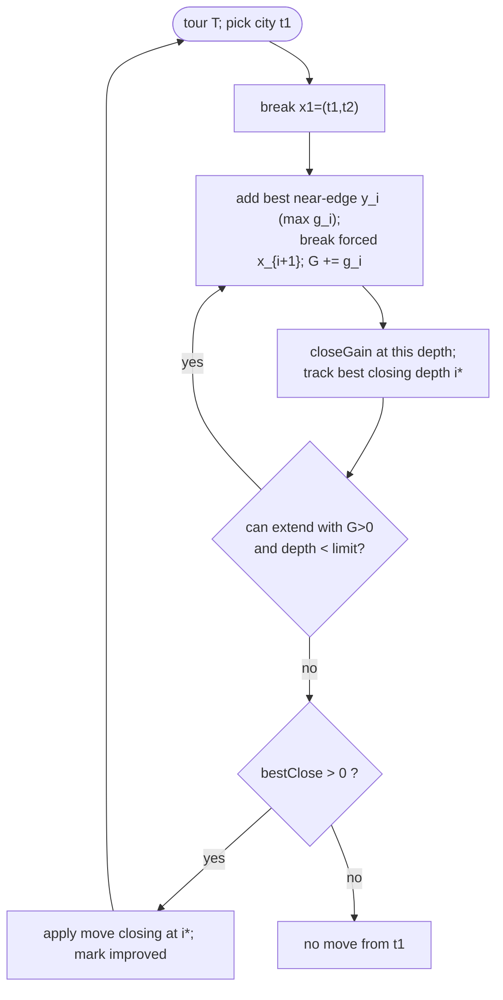

# Lin–Kernighan heuristic — Level 4: Undergraduate CS

> **Example problems:** Traveling Salesman Problem, Vehicle Routing Problem  ·  **Type:** Heuristic (improvement)  ·  **Guarantee:** No formal bound; near-optimal in practice
> **Used for:** Variable-depth edge swaps producing near-optimal tours
> **Level 4 of 6** — undergrad: sequential exchanges, the gain criterion, pseudocode, complexity, mermaid flow. See sibling files for other levels.

---

## Problem statement

Lin–Kernighan (LK) is a **variable-depth** improvement heuristic for symmetric TSP. Where 2-opt/3-opt fix the number of exchanged edges, LK builds a **sequential edge exchange** of *unbounded* depth `k`, choosing `k` per move via a **gain criterion**, and applies the best closing move discovered along the way. It is the practical state of the art for tour quality among single-trajectory local searches.

## Sequential edge exchange

A move is described by alternating **removed** edges `x_i` and **added** edges `y_i` over a vertex trail `t1, t2, t3, …`:

```
x_1 = (t1, t2)   removed (a current tour edge)
y_1 = (t2, t3)   added   (a non-tour edge)
x_2 = (t3, t4)   removed (t4 forced as t3's tour-neighbor)
y_2 = (t4, t5)   added
…                alternating, t_{2i} and t_{2i+1}
```

Constraints that keep the trail **closeable** into a Hamiltonian cycle:
- `x_i` and `y_i` share an endpoint; `y_i` and `x_{i+1}` share an endpoint (alternation).
- `y_i ≠ any x_j` and `x_i ≠ any y_j` (don't add what you removed / vice versa).
- At each depth, **closing edge** `y_i* = (t_{2i}, t1)` must reconnect to `t1` to form a valid tour.

**Gains.** Define the per-step gain `g_i = d(x_i) − d(y_i)` and cumulative `G_i = g_1 + … + g_i`. The **closing gain** at depth `i` is `G_{i-1} + d(x_i) − d(t_{2i}, t1)`: the improvement if you close now.

## The two rules

1. **Positive-gain (extension) criterion:** only extend the chain while `G_i > 0`. Each added edge `y_i` is chosen to **maximize `g_i`** among near-neighbors of the current endpoint (`y_i` short ⇒ `g_i` large), restricted to candidate (neighbor-list) edges.
2. **Best-improvement closing:** at every depth compute the closing gain; remember the depth `i*` giving the **maximum** positive closing gain, and at the end apply *that* closure.

Why rule 1 is safe — the **Lin–Kernighan lemma**: if a finite sequence of reals sums to a positive value, some cyclic permutation has all partial sums positive. So restricting to "keep `G_i > 0`" never hides an overall-improving sequential exchange.

## Pseudocode (one improving move from a city)

```
LK_STEP(T, t1, d, neighbors):
    for t2 in tour-neighbors(t1):           # choose x_1 = (t1,t2)
        bestClose ← 0; bestDepth ← 0; G ← 0
        x ← (t1,t2); base ← d(t1,t2)
        i ← 1; t_curr ← t2
        loop:
            choose t_{2i+1} in neighbors(t_curr), not creating x∈y/y∈x conflicts,
                   maximizing g_i = d(x_i) − d(t_curr, t_{2i+1})
            if no candidate with G + g_i > 0: break        # positive-gain stop
            G ← G + g_i
            t4 ← tour-neighbor of t_{2i+1} (defines x_{i+1})
            closeGain ← G + d(x_{i+1}) − d(t4, t1)
            if closeGain > bestClose: bestClose ← closeGain; bestDepth ← i
            t_curr ← t4; i ← i+1
            if i > DEPTH_LIMIT: break
        if bestClose > ε:
            apply the sequential move closing at bestDepth   # reverses/reconnects
            return improved = true
    return improved = false

LIN_KERNIGHAN(T):
    repeat over all cities (with don't-look bits) until a full pass makes no move
```

**Backtracking (the real LK):** at the first couple of levels LK does **not** just greedily take the best `y_i`; it tries the **breadth** (the ~5 best `y_1`, ~5 best `y_2`) and recurses, accepting the first improving closure — this breadth/depth schedule is what gives LK its quality.

## Complexity

- **Per move:** bounded by the depth limit × neighbor-list breadth — effectively `O(1)`-ish candidates per level with candidate lists; each closure costs a segment reversal (`O(n)` array, `O(√n)` two-level list).
- **Empirical running time:** roughly `O(n^{2.2})` for a full local optimization on geometric instances (Johnson–McGeoch) — comparable to 3-opt, far better quality.
- **Space:** `Θ(n)` working + neighbor lists (`O(n·k)` for `k`-nearest).

## Quality

No worst-case guarantee, but **~1–2% above optimal** on TSPLIB / random Euclidean instances for plain LK — substantially better than 2-opt (~5%) or 3-opt (~3%) at similar cost. The variable depth is what buys this: deep moves where needed, shallow where not.

## Control flow



## Where it sits

LK is the **variable-depth generalization** of the k-opt ladder: a depth-1 LK move *is* a 2-opt move; deeper moves reach 3-opt and beyond, adaptively. It still descends to a **local optimum**, and — like 2-opt/3-opt — it **cannot** make the non-sequential **double-bridge** 4-opt move. Wrapping LK in a perturbation-and-restart loop using exactly that move gives **chained Lin–Kernighan**, the cluster's final and strongest method.

## One-line summary

Variable-depth sequential-exchange improvement heuristic: greedily build a chain of break/add edge swaps under a **positive-gain criterion**, apply the best closure found, repeat to a local optimum — ~1–2% above optimal in `~O(n^{2.2})`, the practical gold standard and the core of LKH and Concorde's upper-bound engine.

