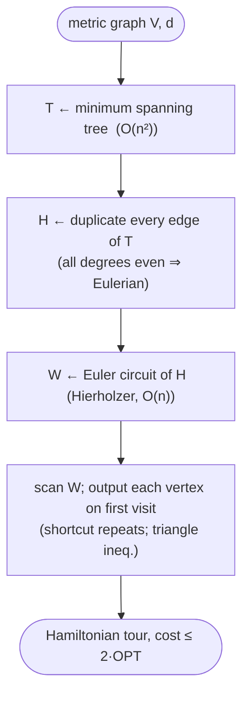

# MST doubling (tree-doubling) — Level 4: Undergraduate CS

> **Example problems:** Metric Traveling Salesman Problem, Vehicle Routing Problem, Network / route design  ·  **Type:** Approximation  ·  **Guarantee:** At most 2× optimal (metric TSP)
> **Used for:** Fast approximate routing with a worst-case guarantee
> **Level 4 of 6** — undergrad: precise statement, pseudocode, Big-O, the 2-approximation proof, control-flow diagram. See sibling files for other levels.

---

## Problem statement

**Metric TSP:** complete graph `K_n` with edge costs `d` satisfying the **triangle inequality** `d(u,w) ≤ d(u,v) + d(v,w)` for all `u,v,w` (and symmetry, non-negativity). Find a minimum-cost Hamiltonian cycle. General TSP is not approximable within any constant unless P=NP, but the metric restriction admits constant-factor approximations — MST doubling gives **factor 2**.

## Algorithm

```
MST_DOUBLE(V, d):
    T  ← minimum spanning tree of (V, d)          # Prim or Kruskal
    H  ← multigraph with every edge of T duplicated   # each tree edge ×2
    # H is connected and every vertex has even degree ⇒ Eulerian
    W  ← Eulerian circuit of H (Hierholzer)        # closed walk using each edge of H once
    tour ← vertices of W in order of FIRST occurrence   # "shortcut" repeats
    return Hamiltonian cycle through `tour`
```

Three primitives: **MST** (greedy, exact), **Euler circuit** (exists because doubling makes all degrees even and keeps the graph connected), and **shortcutting** (skip already-visited vertices — valid because the metric lets a direct edge replace a sub-walk without increasing cost).

## Why each step is well-defined

- **Euler circuit exists:** a connected multigraph has an Eulerian circuit iff every vertex has even degree. Doubling each tree edge gives every vertex degree `2·deg_T(v)` — even — and preserves connectivity. ✓ (Hierholzer's algorithm builds it in linear time.)
- **Shortcutting yields a Hamiltonian cycle:** scanning the Euler circuit and outputting each vertex on first appearance visits every vertex exactly once and returns to start.

## Complexity

- **MST:** `O(m log n)` with a binary-heap Prim/Kruskal on `m` edges; `O(n²)` on a dense/complete graph (often the right choice since metric TSP input is `K_n`, `m = Θ(n²)`).
- **Doubling + Euler circuit (Hierholzer):** `O(|E_H|) = O(n)` (a tree has `n−1` edges; doubled `2(n−1)`).
- **Shortcutting:** `O(n)`.
- **Total:** dominated by the MST → **`O(n²)`** for the complete metric graph (or `O(m log n)` if given a sparse graph). **Space `O(n²)`** for the distance matrix, `O(n)` working.

This is *vastly* faster than the exact methods (`Θ(n!)`, `O(n²2ⁿ)`) — polynomial vs exponential — the trade you make for accepting a 2× bound instead of exactness.

## Correctness: the 2-approximation theorem

**Theorem.** For metric TSP, `cost(MST_DOUBLE) ≤ 2 · OPT`.

**Proof (three inequalities).**
1. **`cost(MST) ≤ OPT`.** Let `C*` be an optimal tour. Removing any one edge of `C*` yields a Hamiltonian *path*, which is a spanning tree `T'`. Then `cost(MST) ≤ cost(T') ≤ cost(C*) = OPT` (edge costs ≥ 0). 
2. **`cost(Euler circuit) = 2 · cost(MST)`.** The Eulerian multigraph `H` is exactly `T` with each edge duplicated, so it uses total weight `2·cost(MST)`, and an Euler circuit traverses each edge exactly once.
3. **`cost(shortcut tour) ≤ cost(Euler circuit)`.** Each shortcut replaces a sub-walk `v → (visited…) → w` by the single edge `(v,w)`; by the **triangle inequality** `d(v,w) ≤` the sum of the skipped edges. So shortcutting never increases length.

Chaining: `cost(tour) ≤ cost(Euler) = 2·cost(MST) ≤ 2·OPT`. ∎

**Tightness:** the factor 2 is essentially tight for this algorithm — instances exist where doubling+shortcutting approaches `2·OPT` (a "caterpillar"/path-like metric forces the Euler detours to nearly double the path). The constant cannot be improved without a smarter step 2 (Christofides → 1.5).

## Control flow



## Guarantee, in one line

Polynomial `O(n²)` metric-TSP **2-approximation**: MST (≤ OPT) → double (Eulerian, ×2) → Euler circuit → shortcut (triangle inequality, no increase) ⇒ tour ≤ 2·OPT; the clean baseline that Christofides sharpens to 1.5.
