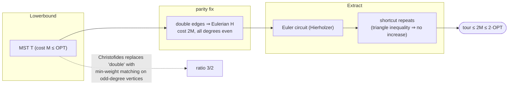

# MST doubling (tree-doubling) — Level 5: Graduate

> **Example problems:** Metric Traveling Salesman Problem, Vehicle Routing Problem, Network / route design  ·  **Type:** Approximation  ·  **Guarantee:** At most 2× optimal (metric TSP)
> **Used for:** Fast approximate routing with a worst-case guarantee
> **Level 5 of 6** — graduate: formal model, the paradigm, tight analysis, edge cases, optimizations, the Christofides bridge. See sibling files for other levels.

---

## 1. Formal setting

**Metric TSP.** Input: finite set `V`, `|V|=n`, with a metric `d: V×V → ℝ≥0` (symmetric, `d(u,u)=0`, triangle inequality `d(u,w) ≤ d(u,v)+d(v,w)`). Output: a Hamiltonian cycle minimizing total cost. Equivalently TSP on a complete graph whose costs are the metric closure of any weighted graph (so "metric TSP" and "shortest-walk TSP allowing revisits" coincide).

**Why the metric restriction.** General (non-metric) TSP has **no polynomial `α`-approximation for any constant `α`** unless P=NP (a reduction from Hamiltonian Cycle plants a huge cost on non-edges; any constant-factor approximator would decide Hamiltonicity). The triangle inequality is exactly the structure that rescues approximability — and the structure shortcutting consumes.

## 2. The design paradigm: structure relaxation → repair

MST doubling is the prototypical **"relax to an easier structure, then repair to feasibility"** approximation:
- **Lower-bounding structure:** the MST is a *relaxation* of the tour (a tour minus an edge is a spanning path ⊇ MST), giving `MST ≤ OPT` — the bound the ratio is measured against.
- **Repair to an Eulerian object:** the obstacle is parity (a tour needs all-even degree to be traceable; a tree has odd-degree vertices). Doubling is the **brute-force parity fix** — make *every* degree even at the cost of a full second copy.
- **Extract a Hamiltonian cycle:** Euler circuit + metric shortcutting.

This three-move template (bound by a subgraph; fix parity to get Eulerian; shortcut) is shared with Christofides — which differs *only* in the parity-fix step, and that single change is what tightens 2 → 3/2.

## 3. Tight analysis

Let `OPT` be the optimal tour cost, `M = cost(MST)`.

```
M ≤ OPT                              (delete one tour edge ⇒ spanning path ⊇ a spanning tree)
cost(Eulerian H) = 2M                (H = MST with every edge duplicated)
cost(shortcut tour) ≤ cost(H) = 2M   (triangle inequality: each shortcut ≤ replaced subwalk)
⇒ ALG ≤ 2M ≤ 2·OPT.
```

**Approximation ratio exactly 2 (tight from above).** Lower-bound family: take `n` points on a path-like metric (e.g. equally spaced on a line, or a "caterpillar" tree where the MST is a near-path). Doubling forces the Euler tour to backtrack along nearly the whole tree; after shortcutting, `ALG/OPT → 2 − o(1)` as `n→∞`. So the analysis is not loose — **2 is the true worst-case ratio of this algorithm**, and any improvement requires changing the parity-fix (Christofides) or the whole approach.

**Integrality / bound quality.** `M ≤ OPT ≤ 2M` always; for Euclidean instances `M` is empirically ~ a constant factor below `OPT`, but the *worst-case* slack of MST as a lower bound is what caps the ratio. (The stronger Held–Karp LP bound — same object as in the Held–Karp DP sibling — is tighter than `M` and underlies the analysis of better algorithms.)

## 4. Annotated pseudocode

```
MST_DOUBLE(V, d):                                 # d a metric on V
    # ---- (1) lower-bounding structure: MST ----
    T ← PRIM(V, d)                                 # O(n²) on the complete metric graph
    # ---- (2) parity repair by doubling ----
    multigraph H ← { (u,v), (u,v) : (u,v) ∈ T }    # each tree edge twice ⇒ all degrees even
    # invariant: H connected ∧ ∀v deg_H(v) ≡ 0 (mod 2)  ⇒  Eulerian
    # ---- (3) Euler circuit + shortcut ----
    W ← HIERHOLZER(H, start = any r)               # closed walk, each edge of H once, O(|E_H|)=O(n)
    seen ← ∅ ;  tour ← [ ]
    for x in W:                                     # shortcut: keep first occurrences
        if x ∉ seen: append x to tour; seen ← seen ∪ {x}
    close tour by returning to tour[0]
    return tour                                     # cost ≤ 2·OPT
```



## 5. Edge cases & invariants

- **Non-metric input breaks the guarantee:** without the triangle inequality, shortcutting can *increase* cost — the 2× bound is void. Apply only to metric (or first take the metric closure via all-pairs shortest paths, which then permits vertex repeats).
- **Asymmetric TSP (ATSP):** MST doubling does **not** apply (no symmetric MST notion / Euler-shortcut argument); ATSP needs different tools (cycle-cover / Frieze–Galbiati–Maffioli `O(log n)`, later the constant-factor Svensson–Tarnawski–Végh / Traub–Vygen results).
- **Disconnected underlying graph:** no spanning tree ⇒ no tour; metric closure assumes connectivity.
- **Invariant after doubling:** connectivity preserved + all degrees even ⇒ Eulerian (Euler's theorem) — the linchpin that makes step 3 always succeed.
- **Determinism / ties:** different MSTs or different Euler traversals/shortcut orders yield different tours, all `≤ 2·OPT`; pick the best of several for a practical edge.

## 6. Optimizations & practical notes

- **Best-of-many starts:** run shortcutting from multiple Euler-circuit start vertices / DFS pre-orders and keep the cheapest tour.
- **DFS-preorder variant:** a common equivalent is "MST → DFS pre-order traversal → visit vertices in pre-order"; the pre-order *is* a shortcut of the doubled-tree Euler tour, same 2-bound, often simpler to implement.
- **Post-processing:** feed the result into **2-opt / Or-opt / Lin–Kernighan** local search — the 2-approx tour is a good *initial* tour, and local search typically drives it to within a few percent of optimal (the construction-then-improvement pipeline).
- **Christofides upgrade:** replace doubling with a **minimum-weight perfect matching on the odd-degree vertices of the MST** (there are an even number of them, by the handshake lemma). Matching cost ≤ OPT/2, so `ALG ≤ M + OPT/2 ≤ 3·OPT/2`. Same Euler+shortcut tail. This is the single-step refinement; it costs an `O(n³)` matching but halves the slack.

**Synthesis:** MST doubling is the canonical metric-TSP **2-approximation** and the clearest instance of the *bound-with-a-tree / fix-parity / shortcut* paradigm. Its analysis is tight (ratio exactly 2), its cost polynomial (`O(n²)`, MST-dominated), and its guarantee hinges entirely on the triangle inequality. It is both a usable fast constructor (especially as a seed for local search) and the conceptual scaffold on which Christofides–Serdyukov improves the constant from 2 to 3/2 by a smarter parity repair.
