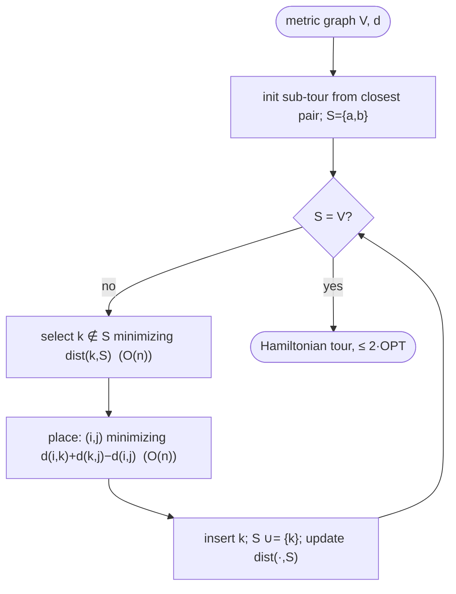

# Nearest insertion — Level 4: Undergraduate CS

> **Example problems:** Traveling Salesman Problem, Vehicle Routing Problem, Drilling / pick-path planning  ·  **Type:** Heuristic (constructive)  ·  **Guarantee:** No formal bound in general
> **Used for:** Growing a tour by inserting the nearest outside node at lowest cost
> **Level 4 of 6** — undergrad: precise statement, pseudocode, Big-O, the 2-approximation (metric), control-flow diagram. See sibling files for other levels.

---

## Problem statement

TSP on `(V, d)`, `|V| = n`. **Insertion heuristics** maintain a *sub-tour* (a cycle through a subset `S ⊆ V`) and grow it one vertex at a time until `S = V`. Each step has two decisions:
- **Selection** — which non-tour vertex `k` to insert next.
- **Placement** — between which adjacent tour vertices `(i, j)` to insert it, always chosen to **minimize the insertion cost** `c(i,k,j) = d(i,k) + d(k,j) − d(i,j)`.

**Nearest insertion** uses the selection rule: pick the vertex `k ∉ S` minimizing its distance to the current tour, `dist(k, S) = min_{v ∈ S} d(k, v)`. On metric instances it is a **2-approximation** — the first constructive heuristic in this series with a *constant* guarantee (vs `Θ(log n)` for nearest neighbor / greedy-edge).

## Pseudocode

```
NEAREST_INSERTION(V, d):
    # init: 2-vertex sub-tour from the closest pair (any start works for the bound)
    (a, b) ← argmin_{u≠v} d(u, v)
    tour ← cycle [a, b]                                  # edges a→b, b→a
    S ← {a, b}
    while S ≠ V:
        # --- selection: vertex nearest to the current tour ---
        k ← argmin_{ k ∉ S }  min_{ v ∈ S } d(k, v)
        # --- placement: cheapest edge to break ---
        (i, j) ← argmin over adjacent (i,j) in tour of  d(i,k) + d(k,j) − d(i,j)
        insert k between i and j in tour
        S ← S ∪ {k}
    return tour
```

Maintaining `dist(k, S)` incrementally (after inserting `k`, update each outside vertex's nearest-tour distance with `min(old, d(·, k))`) avoids recomputing minima from scratch.

## Complexity

- **Selection:** with incremental `dist(·,S)` updates, each insertion updates `O(n)` outside vertices and scans for the min in `O(n)` ⇒ `O(n)` per step.
- **Placement:** scanning all current tour edges is `O(|S|) = O(n)` per step.
- **`n` insertions × `O(n)` ⇒ `Θ(n²)`** time, `Θ(n²)` space for the distance matrix (`Θ(n)` working). Same order as nearest neighbor, but with a constant-factor guarantee it lacks.

## The 2-approximation theorem (metric)

**Theorem.** For metric TSP, nearest insertion produces a tour of cost `≤ 2·OPT`.

**Proof idea.** The argument links insertion to the **minimum spanning tree** (the same lower bound used by MST doubling):
1. The selection rule — always insert the vertex *nearest the current tour* — mirrors **Prim's MST algorithm**, which grows a tree by repeatedly adding the vertex nearest the current tree. One shows the total of the "connection distances" `dist(k,S)` paid across all insertions is `≤ cost(MST)`.
2. The **placement cost** of inserting `k` between `i,j` satisfies `c(i,k,j) = d(i,k)+d(k,j)−d(i,j) ≤ 2·dist(k,S)` by the triangle inequality (inserting next to the nearest tour vertex costs at most twice the connection distance).
3. Summing: `cost(tour) ≤ Σ_k 2·dist(k,S) ≤ 2·cost(MST) ≤ 2·OPT` (since `MST ≤ OPT`).
∎ (Rosenkrantz–Stearns–Lewis 1977.)

So nearest insertion's bound, like MST doubling's, is "2 via the MST" — but built by a different mechanism (loop-growing rather than tree-doubling). The bound is essentially tight for the algorithm.

## Why insertion cost is non-negative

`c(i,k,j) = d(i,k)+d(k,j)−d(i,j) ≥ 0` is exactly the **triangle inequality** — so every insertion grows the tour (never shrinks it), and the metric assumption is what makes the whole analysis (and the algorithm's sanity) work. Non-metric inputs void the guarantee.

## Control flow



## Insertion family at a glance (selection rule varies; placement always cheapest)

| Heuristic | Selection rule | Metric bound |
|-----------|----------------|--------------|
| **Nearest insertion** | vertex nearest the tour | **≤ 2** |
| Cheapest insertion | vertex with smallest *insertion cost* | ≤ 2 |
| Farthest insertion | vertex farthest from the tour | ≤ ~2.43 (empirically excellent) |
| Random insertion | random vertex | ≤ ~2·⌈log n⌉ expected-ish; strong in practice |

## Guarantee, in one line

`Θ(n²)` metric-TSP **2-approximation** that grows a sub-tour by repeatedly inserting the nearest outside vertex at its cheapest position — the first constant-ratio constructive heuristic here, proved via an MST/Prim correspondence, and the template for the cheapest/farthest/random insertion siblings.
