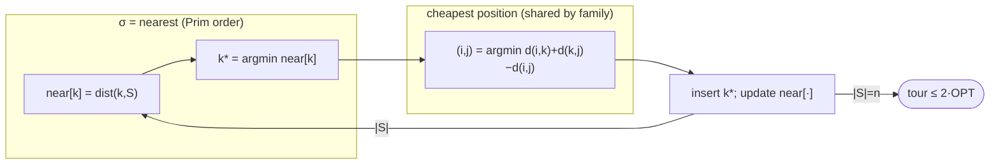

# Nearest insertion — Level 5: Graduate

> **Example problems:** Traveling Salesman Problem, Vehicle Routing Problem, Drilling / pick-path planning  ·  **Type:** Heuristic (constructive)  ·  **Guarantee:** No formal bound in general
> **Used for:** Growing a tour by inserting the nearest outside node at lowest cost
> **Level 5 of 6** — graduate: formal model, the Prim/MST correspondence, the 2-bound proof, tightness, edge cases, optimizations. See sibling files for other levels.

---

## 1. Formal setting and the insertion paradigm

Metric TSP on `(V,d)`. An **insertion heuristic** maintains a Hamiltonian cycle `T_S` on a growing subset `S`, `|S|` from `2` to `n`, defined by two orthogonal policies:

- **Selection policy `σ`:** choose `k ∈ V\S` to insert.
- **Placement policy (fixed):** insert `k` at the **cost-minimizing** position, `argmin_{(i,j)∈T_S} c(i,k,j)` where `c(i,k,j) = d(i,k)+d(k,j)−d(i,j) ≥ 0` (non-negativity ⇔ triangle inequality).

**Nearest insertion** fixes `σ = argmin_{k∉S} dist(k,S)`, `dist(k,S) = min_{v∈S} d(k,v)`. The family (nearest / cheapest / farthest / random) differs *only* in `σ`; the placement rule is shared. This decomposition is the conceptual core: selection controls the *order* vertices enter; cheapest-placement controls *where*.

## 2. The Prim/MST correspondence

The 2-bound rests on a structural parallel to **Prim's algorithm**. Prim grows a tree `M_S` by repeatedly adding the vertex minimizing `dist(k,S)` and connecting it with edge cost `dist(k,S)`. Nearest insertion uses the *identical selection rule*, so it adds vertices in (one valid) Prim order, and the sequence of connection distances `{dist(k,S)}` it pays equals the edge weights of a minimum spanning tree built on the same vertex sequence:
```
Σ_{insertions} dist(k, S_k) = cost(MST).
```
This is why nearest insertion — alone among the family — admits an MST-based analysis that *directly* mirrors MST doubling, despite never building a tree.

## 3. The 2-approximation, proved

**Theorem (RSL 1977).** Metric nearest insertion returns a tour `T` with `cost(T) ≤ 2·OPT`.

**Proof.**
*(a) Placement bounded by connection distance.* When `k` is inserted next to its nearest tour vertex `v* = argmin_{v∈S} d(k,v)` (so `d(k,v*) = dist(k,S)`), consider placing `k` adjacent to `v*` (between `v*` and a tour-neighbor `w`). The insertion cost is
`c = d(v*,k)+d(k,w)−d(v*,w) ≤ d(v*,k) + [d(k,v*)+d(v*,w)] − d(v*,w) = 2·d(k,v*) = 2·dist(k,S)`,
using the triangle inequality `d(k,w) ≤ d(k,v*)+d(v*,w)`. The *cheapest* placement is no worse: `Δcost(k) ≤ 2·dist(k,S)`.

*(b) Sum of connection distances = MST.* By the Prim correspondence, `Σ_k dist(k,S_k) = cost(MST)`.

*(c) MST ≤ OPT.* Deleting an edge from the optimal tour gives a spanning path ⊇ a spanning tree.

Combining: `cost(T) = Σ_k Δcost(k) ≤ Σ_k 2·dist(k,S_k) = 2·cost(MST) ≤ 2·OPT`. ∎

**Tightness.** The factor 2 is essentially tight for nearest insertion: instances (e.g. points where every cheap placement still pays ≈ `2·dist`) drive `cost(T)/OPT → 2`. Like MST doubling, the constant cannot be improved by a sharper analysis — it is the algorithm's true worst case. (Farthest and random insertion have *different* constants; cheapest insertion shares the ≤ 2 bound.)

## 4. Annotated pseudocode (incremental selection)

```
NEAREST_INSERTION(V, d):
    (a,b) ← closest pair; T ← cycle(a,b); S ← {a,b}
    near ← array: near[k] = min_{v∈S} d(k,v)  for k ∉ S        # O(n) init
    while |S| < n:
        k  ← argmin_{k∉S} near[k]                              # selection: O(n)
        (i,j) ← argmin_{(i,j)∈edges(T)} d(i,k)+d(k,j)−d(i,j)   # placement: O(|S|)
        insert k between i,j in T;  S ← S ∪ {k}
        for m ∉ S: near[m] ← min(near[m], d(m,k))              # incremental update: O(n)
    return T
```



Complexity: `Θ(n²)` time (n insertions × O(n) selection+placement+update), `Θ(n²)` space (matrix). A heap on `near[]` does not asymptotically help because each insertion triggers `O(n)` decrease-keys.

## 5. Edge cases & invariants

- **Metric required.** `c(i,k,j) ≥ 0` and step (a) both use the triangle inequality; non-metric inputs void the 2-bound (and can make insertion *decrease* tour length, breaking the analysis). Use the metric closure for general graphs.
- **Initialization.** Any 2-vertex (or single-vertex) seed preserves the bound; "closest pair" is conventional. The seed choice perturbs the output tour but not the worst-case guarantee.
- **Invariant.** `T_S` is always a Hamiltonian cycle on `S`; `near[k] = dist(k,S)` for all `k∉S` is maintained exactly by the incremental update.
- **Ties** (selection or placement) broken arbitrarily; validity unaffected.
- **Asymmetric TSP:** the cheapest-placement cost and the MST argument assume symmetry; ATSP needs a directed variant and loses this clean bound.

## 6. Optimizations & practical notes

- **Incremental `near[]`** (above) is the key efficiency trick; without it selection is `O(n·|S|)` per step.
- **Candidate/neighbor lists** prune placement scans for geometric instances; spatial structures (k-d trees) speed up `dist(k,S)`.
- **Quality vs siblings.** Empirically nearest insertion is typically **~10–25% over optimal** on random Euclidean instances — decent, but **farthest insertion usually wins** among the family (inserting the farthest vertex first lays down a good "skeleton" early, so later cheap insertions refine a near-convex outline). Cheapest insertion is comparable but costlier per step (`O(n²)`-ish placement search). All four beat nearest neighbor's worst case with their constant bounds.
- **Seed for local search.** Like the other constructors, the insertion tour is a strong starting point for **2-opt / Or-opt / Lin–Kernighan**; insertion seeds (especially farthest) often give local search a better basin than NN.

**Synthesis:** nearest insertion is the **insertion paradigm** instantiated with a Prim-style "nearest vertex" selection and the universal cheapest-placement rule. That selection rule makes its connection distances sum to the MST, yielding — via `Δcost(k) ≤ 2·dist(k,S)` and `MST ≤ OPT` — a **tight metric 2-approximation**, the first constant-ratio constructor in this series. It runs in `Θ(n²)`, keeps a complete sub-tour throughout (avoiding the stranded-edge pathologies of path-growers), and is the template whose *selection rule* the cheapest/farthest/random siblings vary to trade worst-case constant against empirical quality.
