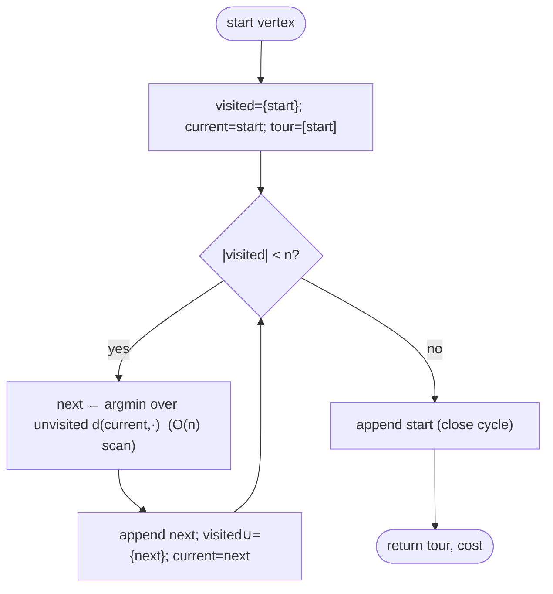

# Nearest neighbor — Level 4: Undergraduate CS

> **Example problems:** Traveling Salesman Problem, Vehicle Routing Problem, Online / greedy route construction  ·  **Type:** Heuristic (constructive)  ·  **Guarantee:** No guarantee; often decent but can be poor
> **Used for:** Building a quick initial tour by always going to the closest unvisited stop
> **Level 4 of 6** — undergrad: precise statement, pseudocode, Big-O, the (lack of) guarantee, control-flow diagram. See sibling files for other levels.

---

## Problem statement

TSP on a graph with `n` vertices and costs `d`. The **nearest-neighbor heuristic** constructs a Hamiltonian cycle greedily: from the current vertex, always move to the nearest *unvisited* vertex; close the tour at the end. It is a **constructive heuristic** — it builds one tour in a single pass, with **no optimality or approximation guarantee** (unlike MST doubling / Christofides).

## Pseudocode

```
NEAREST_NEIGHBOR(V, d, start):
    visited ← { start }
    tour    ← [ start ]
    current ← start
    while |visited| < n:
        next ← argmin_{ v ∈ V \ visited }  d(current, v)     # closest unvisited
        tour.append(next)
        visited.add(next)
        current ← next
    tour.append(start)                       # close the cycle
    return tour, cost(tour)

REPEATED_NN(V, d):                            # mitigate start-vertex sensitivity
    return min over s ∈ V of NEAREST_NEIGHBOR(V, d, s)
```

The only nontrivial step is the `argmin`: scan the unvisited set for the nearest vertex.

## Complexity

- **Single run:** `n−1` steps, each an `O(n)` scan over remaining vertices ⇒ **`Θ(n²)`** time, `Θ(n)` extra space (visited set + tour). With a spatial structure (k-d tree / grid) for geometric instances, nearest-unvisited queries can drop toward `O(log n)` amortized, giving `O(n log n)` overall — though deletions complicate this.
- **Repeated NN (all starts):** `n` runs ⇒ **`Θ(n³)`**.
- This is far cheaper than the exact methods and comparable to the construction cost of the approximation algorithms — its selling point is **speed and simplicity**.

## Guarantees (and why there are none worth celebrating)

- **No constant-factor guarantee.** For metric TSP, nearest neighbor's worst-case ratio is **not** a constant: it is `Θ(log n)`. Specifically (Rosenkrantz–Stearns–Lewis 1977):
  ```
  NN(I) / OPT(I)  ≤  ½ (⌈log₂ n⌉ + 1)      for every metric instance I,
  ```
  and matching instances force `Ω(log n)`. So the tour can be a logarithmic factor worse than optimal, and that gap **grows with n** — qualitatively weaker than the constant 2 (doubling) or 3/2 (Christofides).
- **Non-metric TSP:** unbounded — no finite ratio at all.
- The intuition: greedy commitment leaves "orphan" vertices that must later be reached by long edges; adversarial layouts stack these.

## Correctness (it produces a valid tour) & termination

- **Termination:** each iteration moves one vertex from unvisited to visited; after `n−1` iterations all are visited; the loop halts.
- **Validity:** every vertex is appended exactly once and the start is re-appended, so the output is a Hamiltonian cycle (assuming a complete graph, or a graph where a nearest *reachable* unvisited vertex always exists; on incomplete graphs NN can get stuck — a known failure needing back-edges or a complete/metric-closure input).

## Control flow



## Where it fits

- **Seed for local search:** NN's `Θ(n²)` tour is a standard *initial solution* for 2-opt / Or-opt / Lin–Kernighan, which then remove crossings and long closing edges — the "construct then improve" pipeline.
- **Online / real-time routing:** when stops arrive sequentially and a decision is needed immediately, NN is a natural online policy.
- **Baseline:** the simplest constructive heuristic, the reference point other constructors (greedy edge, insertion methods) are measured against.

## Guarantee, in one line

`Θ(n²)` greedy tour construction — always valid, never optimal, worst case `Θ(log n)·OPT` on metric instances (unbounded otherwise); prized for speed and as a local-search seed, not for quality.
