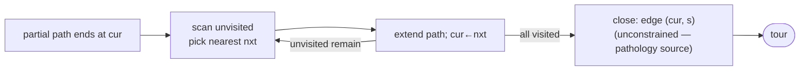

# Nearest neighbor — Level 5: Graduate

> **Example problems:** Traveling Salesman Problem, Vehicle Routing Problem, Online / greedy route construction  ·  **Type:** Heuristic (constructive)  ·  **Guarantee:** No guarantee; often decent but can be poor
> **Used for:** Building a quick initial tour by always going to the closest unvisited stop
> **Level 5 of 6** — graduate: formal analysis, the Θ(log n) bound, the greedy paradigm, average-case, edge cases, optimizations. See sibling files for other levels.

---

## 1. Formal setting and the greedy paradigm

Metric TSP on `(V, d)`, `|V| = n`. Nearest neighbor is a **greedy constructive heuristic**: maintain a partial path `P = (v₀, …, v_k)`; extend by `v_{k+1} = argmin_{v ∉ P} d(v_k, v)`; close with edge `(v_{n−1}, v₀)`. Unlike the *matroid* greedy (Kruskal's MST, which is provably optimal because spanning trees form a matroid), the TSP tour-extension greedy has **no matroid/exchange structure guaranteeing optimality** — local optimal-next-step choices do not compose into a global optimum. NN is the textbook example that "greedy" is a *paradigm*, not a correctness guarantee.

## 2. The Θ(log n) approximation bound

**Theorem (Rosenkrantz, Stearns & Lewis 1977).** For every metric instance,
```
NN(I) / OPT(I) ≤ ½(⌈log₂ n⌉ + 1),
```
and there is a family of metric instances with `NN/OPT = Ω(log n)`. Hence the worst-case ratio is `Θ(log n)` — **unbounded as `n → ∞`**, in contrast to the constant ratios of doubling (2) and Christofides (3/2).

**Upper-bound proof sketch.** Let `a_i = d(v_{i}, v_{i+1})` be the cost NN pays leaving vertex `i` (in visiting order). The core lemma bounds the optimal tour from below using the greedy choices: for each vertex, charge its NN-edge against OPT via a careful summation that pairs greedy edges with disjoint portions of OPT. One shows `Σ a_i ≤ OPT · ½(⌈log₂ n⌉ + 1)` by a dyadic/charging argument: sort the NN edge costs, and use that the `k`-th largest greedy edge is bounded because at the moment it was chosen, all not-yet-visited vertices (including the eventual OPT neighbors) were at least that far — feeding a telescoping `1 + 1/2 + 1/3 + … ` harmonic-type sum that yields the `log n`. (Full proof: RSL 1977 / Vazirani, *Approximation Algorithms*.)

**Lower-bound construction.** Recursive/dyadic metric instances (or specially weighted graphs) where greedy is repeatedly lured into a nearby vertex while a slightly-farther vertex would have avoided a doubling chain of long "return" edges; the long edges accumulate to `Ω(log n)·OPT`.

## 3. Average-case and probabilistic behavior

- On **random Euclidean instances** (`n` points i.i.d. uniform in the unit square), the optimal tour length is `≈ β√n` (Beardwood–Halton–Hammersley constant `β ≈ 0.7124`). Nearest neighbor produces tours `≈ 25%` above optimal *on average* empirically — far better than the `Θ(log n)` worst case, explaining its practical popularity. The last (closing) edge and a handful of long "orphan-collection" edges dominate the excess.
- This worst-case/average-case gap is the standard justification for using NN as a *fast seed* despite its poor guarantee.

## 4. Annotated pseudocode with the closing-edge pathology

```
NEAREST_NEIGHBOR(V, d, s):
    visited ← bitset({s}); tour ← [s]; cur ← s; total ← 0
    for _ in 1 … n-1:
        # argmin over unvisited — Θ(n) naive; O(log n) amortized with a spatial index
        nxt ← argmin_{v: ¬visited[v]} d(cur, v)
        total += d(cur, nxt); visited[nxt] ← true; tour.append(nxt); cur ← nxt
    total += d(cur, s)            # ← the closing edge: NOT minimized, often the worst edge
    return tour, total
```



The structural weakness is explicit: every edge except the last is a *minimized* greedy choice, but the **closing edge `(v_{n−1}, s)` is whatever it is** — frequently a long jump from the last-stranded vertex back to the start. Much of NN's excess cost concentrates there and in a few late orphan edges.

## 5. Variants & optimizations

- **Repeated / best-of-`n` NN:** run from all `n` starts, keep the best — `Θ(n³)`, removes the worst start-vertex luck; still `Θ(log n)` worst case but better typical tours.
- **Double-ended / greedy-endpoint NN:** grow the path from *either* endpoint, extending whichever has the cheaper nearest neighbor — usually beats single-ended NN.
- **Spatial acceleration:** for geometric `d`, k-d trees, grids, or Delaunay neighbor lists answer "nearest unvisited" in `O(log n)`/amortized, giving `O(n log n)` construction; the complication is *deletions* (visited points), handled by lazy deletion or candidate lists.
- **Christofides/greedy hybrids and candidate lists:** restrict the `argmin` to a precomputed `k`-nearest candidate list per vertex (standard in fast TSP codes), trading a negligible quality loss for big speedups.
- **Always pair with local search:** NN → **2-opt / Or-opt / Lin–Kernighan**. NN gives LK/2-opt a much better starting point than a random tour, and local search specifically targets NN's long closing/orphan edges (uncrossing).

## 6. Edge cases & invariants

- **Non-metric `d`:** the `Θ(log n)` bound *requires* the triangle inequality; without it NN has **no finite ratio**.
- **Incomplete graphs:** NN can dead-end (current vertex's only unvisited neighbors are unreachable). Fixes: run on the metric closure (all-pairs shortest paths), or allow backtracking — but then it is no longer the clean `Θ(n²)` one-pass method.
- **Ties:** broken arbitrarily; different tie rules yield different tours, all valid.
- **Invariant:** `tour` is a simple path over `visited` at all times; on completion it is a Hamiltonian path, closed into a cycle by the final edge.
- **Determinism:** fully determined by `(start, tie-rule)`; this sensitivity is *the* reason repeated-NN exists.

**Synthesis:** nearest neighbor is the minimal greedy tour constructor — `Θ(n²)`, trivially correct as a *constructor*, but with a `Θ(log n)` worst-case approximation ratio on metrics (unbounded otherwise) and a characteristic pathology in its unconstrained closing edge. Its value is empirical: ~25% over optimal on average for random Euclidean instances, computed almost instantly, making it the default *seed* for the improvement heuristics (2-opt, LK) and the simplest baseline against which smarter constructors (greedy edge-selection, insertion methods) are judged. It is the canonical reminder that greedy ≠ optimal absent matroid structure.
