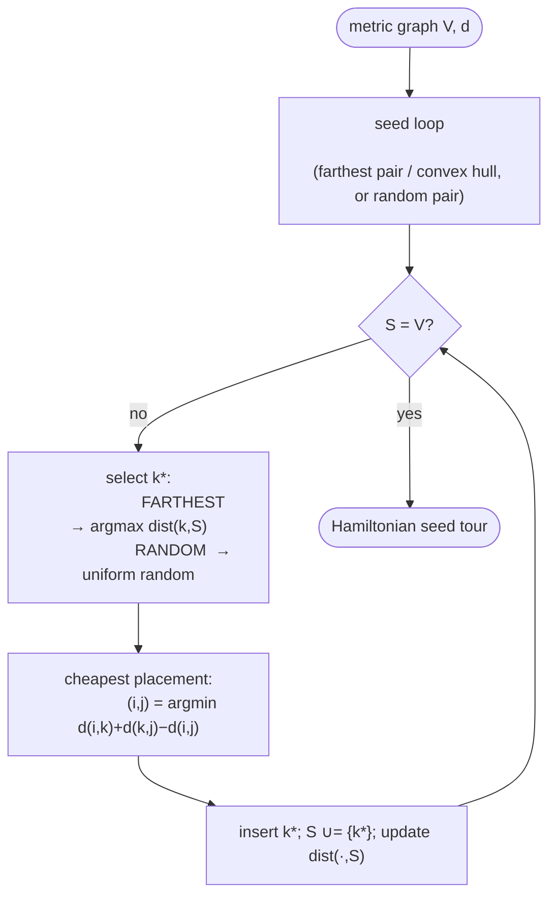

# Random / farthest insertion — Level 4: Undergraduate CS

> **Example problems:** Traveling Salesman Problem, Vehicle Routing Problem, Multi-start metaheuristic seeding  ·  **Type:** Heuristic (constructive)  ·  **Guarantee:** No formal bound
> **Used for:** Generating diverse starting tours by inserting far/random nodes early
> **Level 4 of 6** — undergrad: precise statement, pseudocode, Big-O, the worst-vs-average inversion, mermaid flow. See sibling files for other levels.

---

## Problem statement

TSP on `(V, d)`, `|V| = n`. Both heuristics are insertion-family members sharing the **cheapest placement** rule `c(i,k,j) = d(i,k)+d(k,j)−d(i,j)`; they differ only in **selection**:

- **Farthest insertion:** `k* = argmax_{k ∉ S} dist(k, S)`, where `dist(k,S) = min_{v∈S} d(k,v)` — insert the vertex *maximally far* from the current tour.
- **Random insertion:** `k*` chosen **uniformly at random** from `V \ S`.

Both then place `k*` at its cheapest position. Their shared purpose: produce **high-quality or diverse seed tours** for local search and multi-start metaheuristics.

## Pseudocode

```
INSERTION(V, d, selectRule):                 # selectRule ∈ {FARTHEST, RANDOM}
    seed S, tour:                            # FARTHEST: two farthest-apart cities (or convex hull)
                                             # RANDOM:  a random pair
    # maintain dist[k] = min_{v∈S} d(k,v) for k ∉ S  (the connection distance)
    for k ∉ S: dist[k] ← min_{v∈S} d(k,v)
    while S ≠ V:
        if selectRule = FARTHEST: k* ← argmax_{k∉S} dist[k]      # max connection distance
        else                    : k* ← random element of V\S
        (i*,j*) ← argmin_{(i,j) ∈ edges(tour)} c(i,k*,j)         # cheapest placement
        insert k* between i*,j*; S ← S ∪ {k*}
        for k ∉ S: dist[k] ← min(dist[k], d(k, k*))              # incremental update
    return tour
```

Selection is the only line that changes; placement and the incremental `dist[]` bookkeeping are identical to nearest insertion (`argmax` instead of `argmin` for farthest; a random draw for random).

## Complexity

- **Selection:** farthest = `O(n)` argmax over `dist[]`; random = `O(1)` draw.
- **Placement:** scan tour edges, `O(|S|) = O(n)` per step.
- **`dist[]` update:** `O(n)` per insertion (farthest only; random doesn't need `dist[]` at all, but still pays `O(n)` placement).
- **Totals:** **`Θ(n²)`** time, `Θ(n²)` space (matrix) — identical order to nearest/cheapest insertion. Random insertion is the *cheapest per step* (no `dist[]` maintenance) yet competitive in quality.

## Guarantees — the worst-vs-average inversion

This is the family's headline subtlety:

| Heuristic | Selection | Proven metric worst case | Empirical (rand. Euclidean) |
|-----------|-----------|--------------------------|------------------------------|
| Nearest insertion | nearest vertex | **≤ 2 (tight)** | ~20% over OPT |
| Cheapest insertion | min insertion cost | **≤ 2 (tight)** | ~15–20% |
| **Farthest insertion** | farthest vertex | only the **generic `O(log n)`** insertion bound (`≤ ⌈log₂ n⌉ + 1`) | **~10–15% (best of family)** |
| **Random insertion** | random vertex | generic `O(log n)` (expected) | ~10–15% |

So farthest insertion has a **weaker proven bound** than nearest/cheapest, yet produces **better tours** — a clean case where worst-case ranking inverts the practical ranking. The mechanism: inserting far vertices first fixes the tour's **global skeleton** early (a near-convex outline), leaving only cheap local refinements; nearest/cheapest defer the structure-defining far vertices to the end, where they force costlier detours.

## Why the bound is weaker (intuition)

The tight `2` for nearest/cheapest comes from the **Prim/MST correspondence**: their connection distances telescope to `2·MST ≤ 2·OPT`. Farthest insertion deliberately picks the **maximum** connection distance, so its insertions do **not** mirror Prim, and the clean `2·MST` telescoping is lost — only the looser generic insertion bound survives. Better *typical* tours, weaker *provable* ceiling.

## Control flow



## Where they sit

These close the **constructive insertion family** (nearest → cheapest → farthest → random). Their real role is as **seeds**: farthest gives the strongest single deterministic seed; random gives a *distribution* of seeds for **multi-start** strategies. Both feed directly into the improvement cluster — 2-opt, 3-opt, Lin–Kernighan, chained Lin–Kernighan — which polish a seed toward near-optimal. A farthest-insertion or random-insertion seed plus chained LK is a standard high-quality pipeline.

## One-line summary

`Θ(n²)` insertion-family constructors that select the **farthest** (skeleton-first, empirically best tours) or a **random** (diverse seeds) vertex and place it cheapest — both with only the generic `O(log n)` worst-case bound yet ~10–15% in practice, the canonical **worst-vs-average inversion** and the standard seed generators for local search and multi-start metaheuristics.

