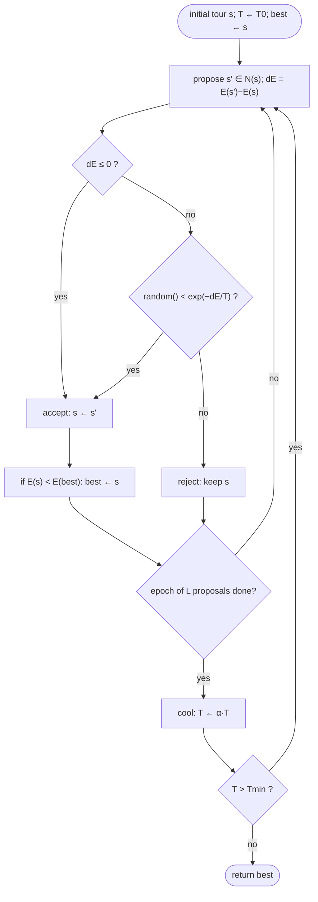

# Simulated annealing — Level 4: Undergraduate CS

> **Example problems:** Traveling Salesman Problem, VLSI circuit placement, Job-shop scheduling, Continuous function optimization  ·  **Type:** Metaheuristic  ·  **Guarantee:** No guarantee; stochastic
> **Used for:** Escaping local minima by accepting worse moves with cooling probability
> **Level 4 of 6** — undergrad: precise statement, the Metropolis criterion, pseudocode, schedules, complexity, mermaid. See sibling files for other levels.

---

## Problem statement

Simulated annealing (SA) is a **metaheuristic** for minimizing a cost `E(s)` over a discrete (or continuous) solution space, using a neighborhood `N(s)` and a temperature parameter `T` that decreases over time. Unlike iterative improvement (2-opt/3-opt/LK), SA accepts **uphill** moves probabilistically, escaping local minima. For TSP, `s` = a tour, `E` = tour length, `N` = the 2-opt (or Or-opt) neighborhood.

## The Metropolis acceptance criterion

Given current `s` and a proposed neighbor `s' ∈ N(s)` with `ΔE = E(s') − E(s)`, accept `s'` with probability

```
P(accept) = 1                  if ΔE ≤ 0      (downhill: always)
          = exp(−ΔE / T)       if ΔE > 0      (uphill: Boltzmann factor)
```

This is the **Metropolis rule** (Metropolis et al. 1953), borrowed from statistical mechanics: at fixed `T`, the induced Markov chain converges to the **Boltzmann distribution** `π_T(s) ∝ exp(−E(s)/T)`, which concentrates on low-cost states as `T → 0`. SA = run Metropolis while slowly lowering `T`.

## Pseudocode

```
SIMULATED_ANNEALING(s0, E, N, T0, alpha, L, Tmin):
    s ← s0;  best ← s0;  T ← T0
    while T > Tmin:
        repeat L times:                      # L proposals per temperature ("epoch")
            s' ← random neighbor in N(s)      # e.g., random 2-opt move
            dE ← E(s') − E(s)
            if dE ≤ 0 or random() < exp(−dE / T):
                s ← s'
                if E(s) < E(best): best ← s   # always remember the incumbent
        T ← alpha · T                         # geometric cooling (alpha ≈ 0.90–0.999)
    return best
```

Key design choices: the **move** (proposal distribution), the **initial temperature** `T0`, the **cooling schedule**, the **epoch length** `L`, and the **stopping** rule.

## Cooling schedules

- **Geometric:** `T ← α·T`, `α ∈ [0.9, 0.999]` — the common default.
- **Logarithmic:** `T_k = c / log(k+2)` — the schedule of the **convergence theorem** (below); guarantees the global optimum *in the limit* but is impractically slow.
- **Adaptive / reheating:** adjust `α` or raise `T` when acceptance stalls; restart-style "reannealing."
- **`T0` calibration:** pick `T0` so the initial **acceptance ratio** of uphill moves is high (e.g., ~0.8) — measured by sampling random moves before the run.

## Why it escapes local minima

Pure descent rejects every `ΔE > 0`, freezing at the first local minimum. SA's `exp(−ΔE/T)` gives uphill moves a **nonzero** probability, so the chain can climb out of a basin and into a deeper one. The temperature tunes the **explore/exploit** balance: high `T` ≈ random walk (explore), low `T` ≈ greedy descent (exploit). The schedule interpolates smoothly from one to the other.

## Convergence guarantee (theory vs. practice)

**Theorem (Geman & Geman 1984; Hajek 1988).** With a logarithmic schedule `T_k ≥ c / log(k+1)` for a sufficiently large constant `c` (related to the deepest local-minimum barrier), SA converges in probability to a global optimum as `k → ∞`.

This is an **asymptotic** result requiring infinitely slow cooling — it certifies the *idea* is sound but gives no finite-time bound. In practice SA uses fast geometric schedules and has **no guarantee**; it is a heuristic.

## Complexity

- **Per proposal:** `O(1)`–`O(n)` — a 2-opt `ΔE` is `O(1)` (four distances); applying the move is `O(n)` array reversal or `O(√n)` with a two-level list (same machinery as 2-opt).
- **Total:** `(number of temperatures) × L` proposals. Runtime is set by the schedule, not the instance size directly — fully tunable to a time budget.
- **Space:** `Θ(n)` for the tour (+ `Θ(n²)` if an explicit distance matrix is used).

## Control flow



## Where it sits

SA is the first **metaheuristic** in this registry and one specific answer to the question chained Lin–Kernighan posed: *how do you escape a local optimum?* SA's answer is **probabilistic uphill acceptance with cooling**. Its siblings answer differently: **tabu search** (forbid recently-seen moves via memory), **GRASP** (randomized-greedy multi-start), **VNS** (systematically change the neighborhood), **genetic / ant-colony** (population-based). On TSP, SA is rarely the winner (Lin–Kernighan-class methods dominate), but its generality across problem domains is unmatched.

## One-line summary

A general-purpose metaheuristic that proposes random neighbor moves and accepts uphill ones with probability `exp(−ΔE/T)` while **cooling** `T → 0` — escaping local minima via the Metropolis rule, globally optimal under impractical logarithmic cooling, and broadly applicable far beyond TSP.

