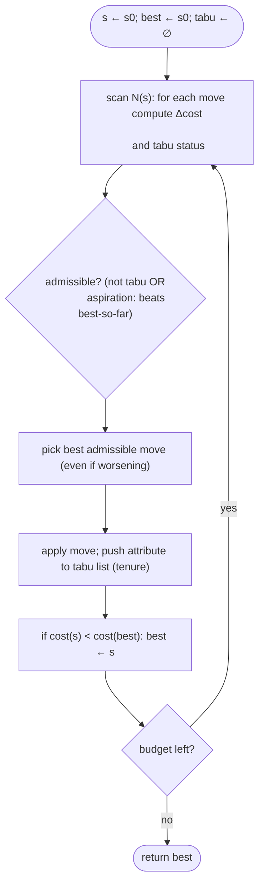

# Tabu search — Level 4: Undergraduate CS

> **Example problems:** Traveling Salesman Problem, Job-shop scheduling, Quadratic assignment  ·  **Type:** Metaheuristic  ·  **Guarantee:** No guarantee; avoids cycling
> **Used for:** Local search with memory of recent moves to avoid revisiting solutions
> **Level 4 of 6** — undergrad: precise statement, tabu list / aspiration, pseudocode, complexity, mermaid. See sibling files for other levels.

---

## Problem statement

Tabu search (Glover 1986) is a **single-solution metaheuristic** that extends iterative improvement with **adaptive memory**. At each step it moves to the **best admissible neighbor** — even if it worsens the objective — and stores recent move **attributes** in a **tabu list** that temporarily forbids reversing them, preventing cycling and forcing exploration past local optima. For TSP, the neighborhood is typically 2-opt/Or-opt and the tabu attribute is an edge (or edge pair) added/removed.

## Core components

- **Neighborhood `N(s)`:** candidate moves (e.g. all 2-opt swaps).
- **Tabu list + tenure:** a short-term memory of the last few move attributes; each stays tabu for `t` iterations (the **tenure**). A move is tabu if it would reverse a remembered attribute. Stored as **attributes**, not full solutions, so memory is `O(tenure)` and checking is `O(1)` with a hash / "last-used iteration" table.
- **Aspiration criterion:** override tabu status if the move yields a solution better than the best-so-far (most common rule).
- **Best-improvement selection:** scan `N(s)`, take the best **admissible** (non-tabu *or* aspiration-satisfying) move.
- **Long-term memory (optional):** frequency-based **diversification** (penalize often-used attributes to push into new regions) and **intensification** (reward attributes of elite solutions / return to them).

## Pseudocode

```
TABU_SEARCH(s0, N, cost, tenure, maxIter):
    s ← s0;  best ← s0
    tabu ← {}                                  # attribute → iteration it becomes free
    for it in 1..maxIter:
        bestMove ← null;  bestVal ← +∞
        for move in N(s):
            s' ← apply(move, s);  v ← cost(s')
            isTabu ← attribute(move) in tabu and tabu[attribute(move)] > it
            aspire ← v < cost(best)
            if (not isTabu or aspire) and v < bestVal:
                bestVal ← v;  bestMove ← move;  bestS ← s'
        if bestMove = null: break              # no admissible move
        s ← bestS
        tabu[attribute(bestMove)] ← it + tenure   # forbid reversal for `tenure` steps
        if cost(s) < cost(best): best ← s
    return best
```

Note the structural difference from descent: there is **no "stop at local optimum"** test — tabu search keeps moving for a fixed budget, and `best` (not the current `s`) is the answer.

## Tabu tenure and what to forbid

- **Tenure `t`:** too small ⇒ short cycles reappear; too large ⇒ too many moves blocked, search starved. Typical `t ≈ √n` or a small constant; **reactive tabu search** (Battiti–Tecchiolli) adapts `t` online by detecting repetition.
- **Attribute granularity:** forbidding a *whole solution* is precise but costly and rarely repeats; forbidding a *move* or an *edge attribute* is cheap and generalizes — the standard choice. Coarser attributes forbid more (sometimes innocent) moves, which aspiration mitigates.

## Complexity

- **Per iteration:** scan `N(s)` (`Θ(n²)` for the 2-opt neighborhood) with `O(1)` tabu checks and `O(1)` incremental `Δcost` per move ⇒ `Θ(n²)` per step; neighbor lists / candidate restriction reduce the effective scan.
- **Total:** `O(maxIter · |N|)`. Memory `O(tenure)` for the list (+ `O(n²)` matrix). Budget-driven runtime.

## Control flow



## Where it sits

Tabu search is the **memory-based** single-solution metaheuristic. Compared with its cluster siblings: **simulated annealing** escapes local optima *stochastically* (accept worse with probability `e^{−Δ/T}`); tabu search escapes *deterministically* (accept the best non-tabu move, ban backtracking). It shares its inner neighborhood (2-opt/Or-opt) with the local-search cluster and, like the others, is often **hybridized** with deeper local search. Its three single-solution siblings escape differently — **iterated local search** (perturb + re-optimize), **variable neighborhood search** (change the neighborhood), **GRASP** (randomized-greedy restart).

## One-line summary

Memory-augmented local search: always take the best **non-tabu** neighbor (even if worsening), forbid reversing recent moves via a **tabu list** (with an **aspiration** override), and track the best-ever — a deterministic escape from local optima, strongest on scheduling/assignment, with no guarantee.

