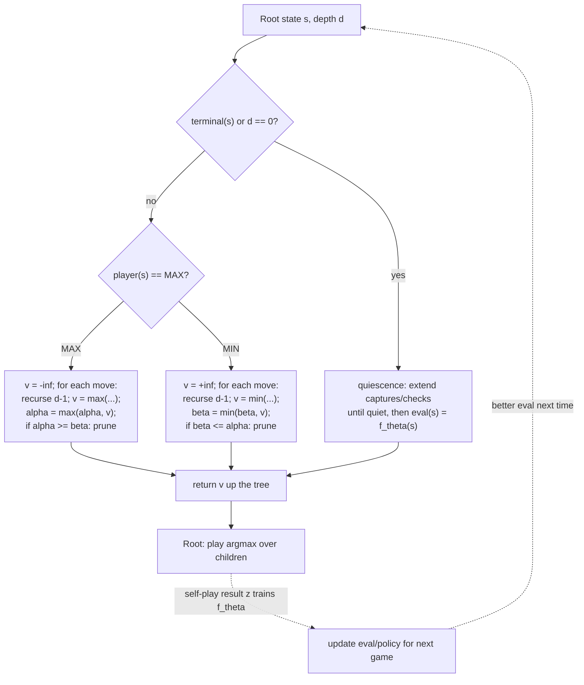

# Adversarial game-tree search - minimax to AlphaZero — Level 4: Undergraduate CS

> **Example problems:** Chess, Go, Checkers, two-player zero-sum games  ·  **Type:** Adversarial search + RL (ensemble)  ·  **Guarantee:** Minimax/alpha-beta return the exact minimax value at full depth; with a depth limit + learned eval there is no guarantee
> **Used for:** Choosing long-horizon optimal play over greedy local gains in adversarial games, and learning the evaluation across games
> **Level 4 of 6** — undergrad CS: precise problem statement, pseudocode, Big-O, correctness intuition, control-flow diagram. See sibling files for other levels.

---

## Problem statement

A **two-player, zero-sum, perfect-information** game is a tuple `(S, A, result, terminal, utility, player)`:

- `S` — states; `player(s) ∈ {MAX, MIN}` whose turn it is.
- `A(s)` — legal actions; `result(s, a)` — the successor state.
- `terminal(s)` — is the game over; `utility(s)` — final payoff to MAX (e.g. +1 win / 0 draw / −1 loss). Zero-sum: MIN's payoff is `−utility`.

The **minimax value** of a state is the payoff to MAX under optimal play by both sides:

```
V(s) = utility(s)                              if terminal(s)
     = max over a in A(s) of V(result(s,a))    if player(s) = MAX
     = min over a in A(s) of V(result(s,a))    if player(s) = MIN
```

The agent plays `argmax_a V(result(s,a))`. **Greedy** instead plays `argmax_a eval(result(s,a))` — a depth-0 special case that ignores the opponent's reply. The whole point of this ensemble is to *not* do that.

Because games like chess are far too large to recurse to `terminal`, we cut off at depth `d` and substitute a heuristic **evaluation function** `eval(s) ≈ V(s)`.

## Core search (depth-limited minimax + evaluation)

```
function minimax(s, d):
    if terminal(s) or d == 0:
        return eval(s)                         # heuristic stand-in for V(s)
    if player(s) == MAX:
        best = -inf
        for a in A(s): best = max(best, minimax(result(s,a), d-1))
        return best
    else:
        best = +inf
        for a in A(s): best = min(best, minimax(result(s,a), d-1))
        return best
```

### Alpha-beta pruning (same answer, far less work)

`alpha` = best value MAX can already guarantee; `beta` = best (lowest) MIN can guarantee. If they cross, the rest of the branch can't affect the result, so we prune it.

```
function alphabeta(s, d, alpha, beta):
    if terminal(s) or d == 0:
        return quiescence(s, alpha, beta)      # see below, not raw eval
    if player(s) == MAX:
        v = -inf
        for a in A(s):
            v = max(v, alphabeta(result(s,a), d-1, alpha, beta))
            alpha = max(alpha, v)
            if alpha >= beta: break             # beta cutoff — prune
        return v
    else:
        v = +inf
        for a in A(s):
            v = min(v, alphabeta(result(s,a), d-1, alpha, beta))
            beta = min(beta, v)
            if beta <= alpha: break             # alpha cutoff — prune
        return v
```

### Quiescence search (defuse the horizon effect)

The depth cutoff can freeze the score mid-trade. Quiescence extends the search through "loud" moves (captures/checks) only, until the position is **quiet**, so the leaf score reflects a stable position:

```
function quiescence(s, alpha, beta):
    stand_pat = eval(s)                         # option to "do nothing" / stop here
    if stand_pat >= beta: return beta
    alpha = max(alpha, stand_pat)
    for a in tactical_moves(s):                 # captures, promotions, checks
        score = -quiescence(result(s,a), -beta, -alpha)
        if score >= beta: return beta
        alpha = max(alpha, score)
    return alpha
```

## Complexity

- Branching factor `b`, search depth `d`.
- **Minimax:** `O(b^d)` time, `O(b·d)` space (recursion stack). For chess `b ≈ 35`.
- **Alpha-beta:** with *adversarial worst-case* ordering it degrades to `O(b^d)`, but with **good move ordering** it reaches `O(b^{d/2}) = O(√(b^d))` — effectively **doubling the depth** searchable in the same time. Move ordering (try likely-best moves first, e.g. captures, killer moves, transposition-table hints) is what makes real engines fast.
- Quiescence adds a bounded tactical extension at the leaves.

## Correctness & termination

- **Termination:** `d` strictly decreases each recursion and `A(s)` is finite ⇒ the tree is finite ⇒ it halts. Quiescence terminates because tactical move sequences are finite (material is bounded).
- **Correctness of alpha-beta:** it returns *exactly* the same value as full-window minimax — pruned branches are provably unable to change a `max`/`min` already bounded by `[alpha, beta]`. (Proof sketch lives at Level 5.)
- **The catch:** at depth `d < ∞` you get `eval`-based values, not true `V(s)`. Quality now hinges entirely on `eval`.

## Where AlphaZero enters: learn `eval` (and the move ordering)

Classical engines hand-write `eval` (material + positional tables). The modern leap is to **learn** it. Replace `eval(s)` with a neural network `f_θ(s) = (v, p)`:

- `v ∈ [−1, 1]` — predicted game outcome from `s` (the learned evaluation).
- `p` — a prior probability over moves (a learned move-ordering / policy).

Train `θ` by **self-play reinforcement learning**: the program plays itself, a search (Monte Carlo Tree Search, guided by `p` and `v`) picks moves, and the final result `z ∈ {−1,0,+1}` is used as the training target for `v`, while the search's visit distribution trains `p`. No human games, no human-written eval. (Formal update rules and MCTS are Level 5–6.)



**One-line takeaway:** minimax + alpha-beta + quiescence give you provably-correct look-ahead that beats greedy; swapping the hand-written `eval` for a *self-play-learned* network is the step from classical engines to AlphaZero.
