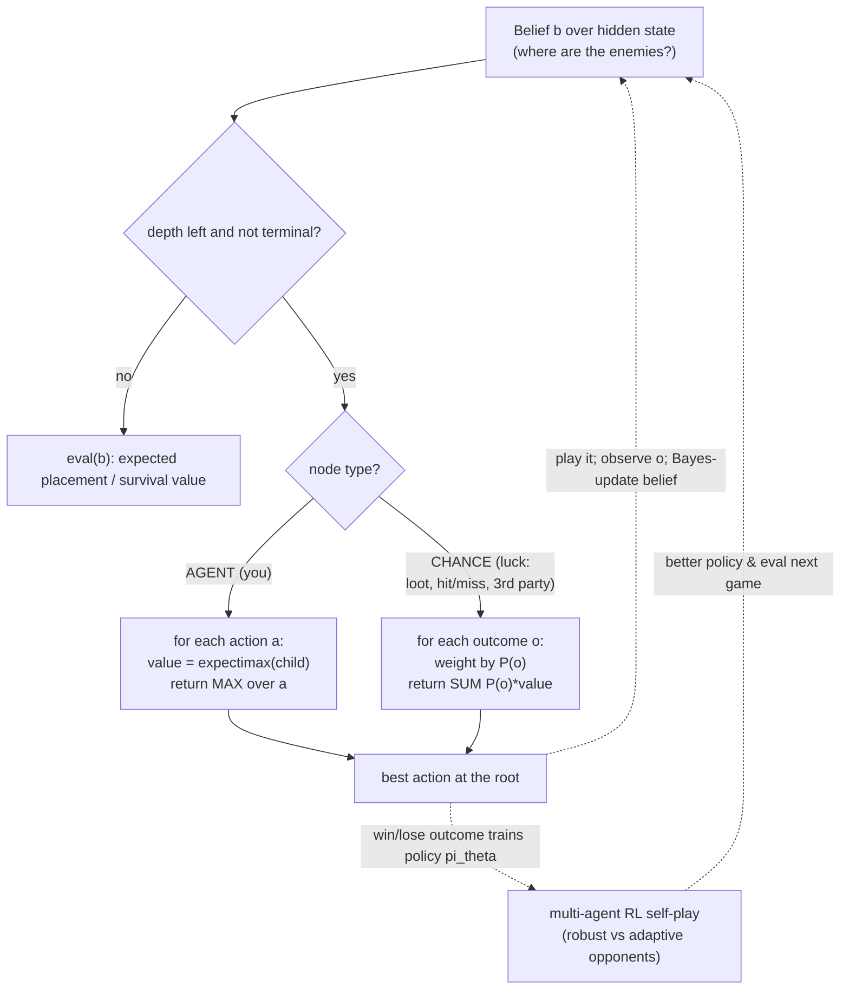

# Survival games: expectimax to multi-agent RL — Level 4: Undergraduate CS

> **Example problems:** Battle royale (Fortnite / PUBG), poker, partially-observable stochastic games  ·  **Type:** Stochastic + imperfect-info + multi-agent RL (ensemble)  ·  **Guarantee:** Expectimax/expectiminimax are exact for the modeled tree; under partial observability + many agents, exact optimal play is intractable (no guarantee)
> **Used for:** Maximizing expected survival/placement under uncertainty in many-player stochastic games, rather than greedily taking the nearest reward
> **Level 4 of 6** — undergrad CS: precise statement, pseudocode, Big-O, correctness intuition, control-flow diagram. See sibling files for other levels.

---

## Why minimax doesn't fit, and what replaces it

Chess is two-player, zero-sum, deterministic, perfect-information → minimax is the right model. A survival game (battle royale) breaks **all four** assumptions:

| Assumption | Chess | Survival game | Consequence |
|---|---|---|---|
| Players | 2 | N (~100) | **general-sum**, not zero-sum |
| Information | perfect | partial (hidden positions) | need **beliefs** (POMDP) |
| Dynamics | deterministic | stochastic (loot, spread, third parties) | need **expectation** (expectimax) |
| Reward | checkmate (material proxy) | survival / placement | optimize **expected rank**, not kills |

So the model is a **Partially Observable Stochastic Game (POSG)**. We build it up from three tractable pieces.

### Piece 1 — Expectimax (handle randomness)

For a single agent against a *stochastic* environment, replace MIN nodes with **chance nodes** that take an expectation:

```
function expectimax(s, d):
    if terminal(s) or d == 0:
        return eval(s)
    if node_type(s) == AGENT:                       # you choose
        return max over a in A(s) of expectimax(result(s,a), d-1)
    if node_type(s) == CHANCE:                       # nature/randomness chooses
        return sum over o in outcomes(s) of P(o) * expectimax(result(s,o), d-1)
```

If there is *also* an adversary, interleave a MIN layer → **expectiminimax** (used in backgammon: MAX / MIN / CHANCE). The key change vs. minimax: at chance nodes you **average**, you do not take the worst case. The earlier "should I take the kill?" calc is exactly one AGENT node over two actions, each leading to a CHANCE node (win / third-party / lose).

### Piece 2 — Belief state (handle hidden information → POMDP)

You can't observe the true state `s` (enemy positions). A **POMDP** maintains a **belief** `b` = probability distribution over states, updated by Bayes' rule after taking action `a` and seeing observation `o`:

```
b'(s') = η · O(o | s', a) · Σ_s T(s' | s, a) · b(s)        # η normalizes to sum 1
```

Planning then happens over **beliefs** instead of states (the "belief MDP"): `V(b) = max_a [ R(b,a) + γ Σ_o P(o|b,a) V(b') ]`.

### Piece 3 — Many adaptive agents (→ POSG, solved by learning)

With N agents that each learn, there's no fixed "nature" to take an expectation over — the other agents' policies *are* the environment, and they change. Exact POSG solving is intractable, so in practice you **learn** a policy `π_θ(a | observation history)` by **multi-agent reinforcement learning with self-play** (Levels 5–6): run many games, reinforce actions that lead to high placement, and train against copies of yourself so the policy is robust to adaptive opponents.

## Complexity & guarantees

- **Expectimax:** with branching `b` (actions) and `c` (chance outcomes) to depth `d`: `O((b·c)^d)` time, `O((b+c)·d)` space. **No** alpha-beta-style `√` speedup in general at chance nodes (you must visit every outcome to form the expectation; bounded variants like `*`-minimax exist when leaf values are bounded).
- **POMDP exact planning:** finite-horizon is **PSPACE-hard**; infinite-horizon optimal is **undecidable**. Real systems use approximations (point-based value iteration, particle filters, or learned recurrent policies).
- **POSG (many agents):** harder still (**NEXP**-class for the general case) — which is *why* the field uses approximate, learned, self-play methods rather than exact solvers.
- **Correctness intuition:** expectimax returns the true expected value *of the modeled tree* (linearity of expectation at chance nodes, maximization at agent nodes); termination is guaranteed because `d` strictly decreases and action/outcome sets are finite. The gap to reality is entirely in the **model** (the probabilities, the belief, the opponent policies) — not the backup rule.



**One-line takeaway:** swap minimax's worst-case MIN for **expectation over chance** (expectimax), plan over a **belief** when you can't see the state (POMDP), and **learn** the policy by self-play when there are many adaptive agents (multi-agent RL) — together they optimize *expected survival*, which is why passing a noisy, low-value kill is so often correct.
